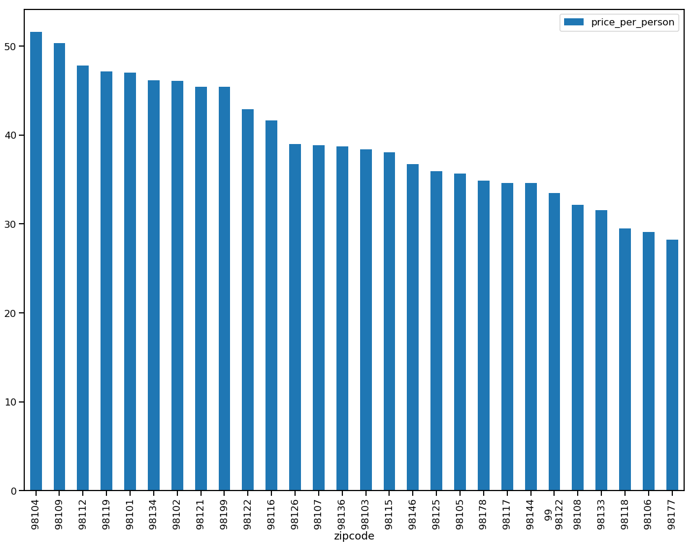
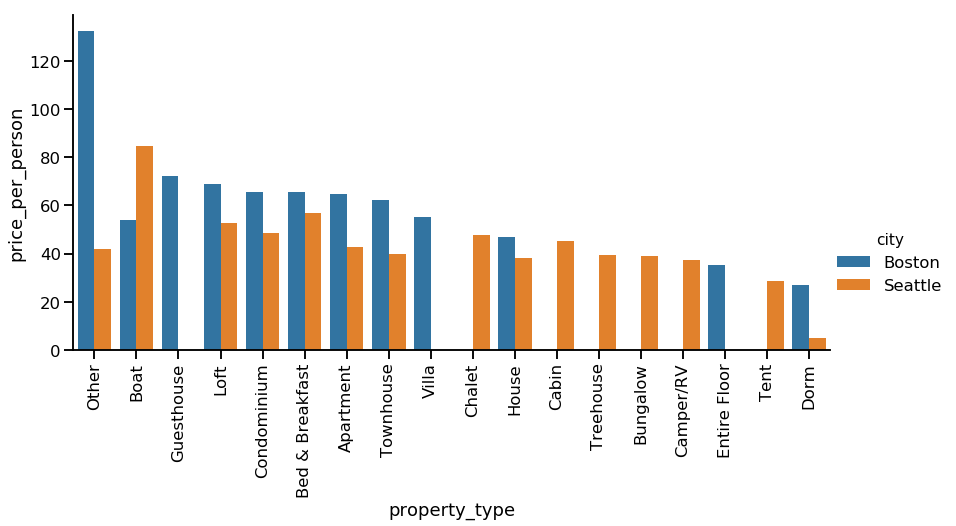
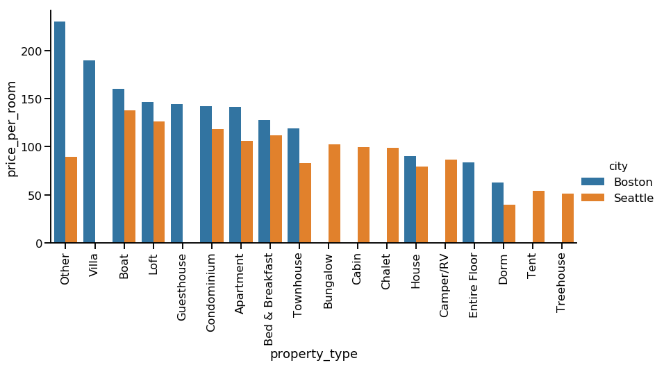

AirBnB DataSet
^^^^^^^^^^^^^^

For my project,I am going to investiagate the AirBnB dataset and try to
answer three questions:

1. What areas have the highest priced AirBnB homes?

2. What do the different types of properties earn on Average ?How do
   prices differ between between Seattle and Boston?

3. What are factors that mostly affect AirbnB prices?

Data Set Investigation
^^^^^^^^^^^^^^^^^^^^^^

.. code:: ipython3

    
    import numpy as np
    import os
    import gmaps
    gmaps.configure(api_key=os.environ["GOOGLE_API_KEY"])
    import pandas as pd
    import matplotlib.pyplot as plt
    from sklearn.linear_model import LinearRegression
    from sklearn.model_selection import train_test_split
    from sklearn.metrics import r2_score, mean_squared_error
    #import AllTogether as t
    import seaborn as sns
    %matplotlib inline
    pd.options.mode.chained_assignment = None  # default='warn'
    #surveys_copy= surveys_df.copy()

.. code:: ipython3

    ## Reading in the listings for seattle
    
    df_s_listings = pd.read_csv('s_listings.csv')
    df_s_listings.head()

.. raw:: html

    

    
    <table border="1" class="dataframe">
      <thead>
        <tr style="text-align: right;">
          <th></th>
          <th>id</th>
          <th>listing_url</th>
          <th>scrape_id</th>
          <th>last_scraped</th>
          <th>name</th>
          <th>summary</th>
          <th>space</th>
          <th>description</th>
          <th>experiences_offered</th>
          <th>neighborhood_overview</th>
          <th>...</th>
          <th>review_scores_value</th>
          <th>requires_license</th>
          <th>license</th>
          <th>jurisdiction_names</th>
          <th>instant_bookable</th>
          <th>cancellation_policy</th>
          <th>require_guest_profile_picture</th>
          <th>require_guest_phone_verification</th>
          <th>calculated_host_listings_count</th>
          <th>reviews_per_month</th>
        </tr>
      </thead>
      <tbody>
        <tr>
          <th>0</th>
          <td>241032</td>
          <td>https://www.airbnb.com/rooms/241032</td>
          <td>20160104002432</td>
          <td>2016-01-04</td>
          <td>Stylish Queen Anne Apartment</td>
          <td>NaN</td>
          <td>Make your self at home in this charming one-be...</td>
          <td>Make your self at home in this charming one-be...</td>
          <td>none</td>
          <td>NaN</td>
          <td>...</td>
          <td>10.0</td>
          <td>f</td>
          <td>NaN</td>
          <td>WASHINGTON</td>
          <td>f</td>
          <td>moderate</td>
          <td>f</td>
          <td>f</td>
          <td>2</td>
          <td>4.07</td>
        </tr>
        <tr>
          <th>1</th>
          <td>953595</td>
          <td>https://www.airbnb.com/rooms/953595</td>
          <td>20160104002432</td>
          <td>2016-01-04</td>
          <td>Bright &amp; Airy Queen Anne Apartment</td>
          <td>Chemically sensitive? We've removed the irrita...</td>
          <td>Beautiful, hypoallergenic apartment in an extr...</td>
          <td>Chemically sensitive? We've removed the irrita...</td>
          <td>none</td>
          <td>Queen Anne is a wonderful, truly functional vi...</td>
          <td>...</td>
          <td>10.0</td>
          <td>f</td>
          <td>NaN</td>
          <td>WASHINGTON</td>
          <td>f</td>
          <td>strict</td>
          <td>t</td>
          <td>t</td>
          <td>6</td>
          <td>1.48</td>
        </tr>
        <tr>
          <th>2</th>
          <td>3308979</td>
          <td>https://www.airbnb.com/rooms/3308979</td>
          <td>20160104002432</td>
          <td>2016-01-04</td>
          <td>New Modern House-Amazing water view</td>
          <td>New modern house built in 2013.  Spectacular s...</td>
          <td>Our house is modern, light and fresh with a wa...</td>
          <td>New modern house built in 2013.  Spectacular s...</td>
          <td>none</td>
          <td>Upper Queen Anne is a charming neighborhood fu...</td>
          <td>...</td>
          <td>10.0</td>
          <td>f</td>
          <td>NaN</td>
          <td>WASHINGTON</td>
          <td>f</td>
          <td>strict</td>
          <td>f</td>
          <td>f</td>
          <td>2</td>
          <td>1.15</td>
        </tr>
        <tr>
          <th>3</th>
          <td>7421966</td>
          <td>https://www.airbnb.com/rooms/7421966</td>
          <td>20160104002432</td>
          <td>2016-01-04</td>
          <td>Queen Anne Chateau</td>
          <td>A charming apartment that sits atop Queen Anne...</td>
          <td>NaN</td>
          <td>A charming apartment that sits atop Queen Anne...</td>
          <td>none</td>
          <td>NaN</td>
          <td>...</td>
          <td>NaN</td>
          <td>f</td>
          <td>NaN</td>
          <td>WASHINGTON</td>
          <td>f</td>
          <td>flexible</td>
          <td>f</td>
          <td>f</td>
          <td>1</td>
          <td>NaN</td>
        </tr>
        <tr>
          <th>4</th>
          <td>278830</td>
          <td>https://www.airbnb.com/rooms/278830</td>
          <td>20160104002432</td>
          <td>2016-01-04</td>
          <td>Charming craftsman 3 bdm house</td>
          <td>Cozy family craftman house in beautiful neighb...</td>
          <td>Cozy family craftman house in beautiful neighb...</td>
          <td>Cozy family craftman house in beautiful neighb...</td>
          <td>none</td>
          <td>We are in the beautiful neighborhood of Queen ...</td>
          <td>...</td>
          <td>9.0</td>
          <td>f</td>
          <td>NaN</td>
          <td>WASHINGTON</td>
          <td>f</td>
          <td>strict</td>
          <td>f</td>
          <td>f</td>
          <td>1</td>
          <td>0.89</td>
        </tr>
      </tbody>
    </table>
    
5 rows × 92 columns

    

.. code:: ipython3

    ## Reading in the listings for Boston
    
    df_b_listings = pd.read_csv('b_listings.csv')
    df_b_listings.head()

.. raw:: html

    

    
    <table border="1" class="dataframe">
      <thead>
        <tr style="text-align: right;">
          <th></th>
          <th>id</th>
          <th>listing_url</th>
          <th>scrape_id</th>
          <th>last_scraped</th>
          <th>name</th>
          <th>summary</th>
          <th>space</th>
          <th>description</th>
          <th>experiences_offered</th>
          <th>neighborhood_overview</th>
          <th>...</th>
          <th>review_scores_value</th>
          <th>requires_license</th>
          <th>license</th>
          <th>jurisdiction_names</th>
          <th>instant_bookable</th>
          <th>cancellation_policy</th>
          <th>require_guest_profile_picture</th>
          <th>require_guest_phone_verification</th>
          <th>calculated_host_listings_count</th>
          <th>reviews_per_month</th>
        </tr>
      </thead>
      <tbody>
        <tr>
          <th>0</th>
          <td>12147973</td>
          <td>https://www.airbnb.com/rooms/12147973</td>
          <td>20160906204935</td>
          <td>2016-09-07</td>
          <td>Sunny Bungalow in the City</td>
          <td>Cozy, sunny, family home.  Master bedroom high...</td>
          <td>The house has an open and cozy feel at the sam...</td>
          <td>Cozy, sunny, family home.  Master bedroom high...</td>
          <td>none</td>
          <td>Roslindale is quiet, convenient and friendly. ...</td>
          <td>...</td>
          <td>NaN</td>
          <td>f</td>
          <td>NaN</td>
          <td>NaN</td>
          <td>f</td>
          <td>moderate</td>
          <td>f</td>
          <td>f</td>
          <td>1</td>
          <td>NaN</td>
        </tr>
        <tr>
          <th>1</th>
          <td>3075044</td>
          <td>https://www.airbnb.com/rooms/3075044</td>
          <td>20160906204935</td>
          <td>2016-09-07</td>
          <td>Charming room in pet friendly apt</td>
          <td>Charming and quiet room in a second floor 1910...</td>
          <td>Small but cozy and quite room with a full size...</td>
          <td>Charming and quiet room in a second floor 1910...</td>
          <td>none</td>
          <td>The room is in Roslindale, a diverse and prima...</td>
          <td>...</td>
          <td>9.0</td>
          <td>f</td>
          <td>NaN</td>
          <td>NaN</td>
          <td>t</td>
          <td>moderate</td>
          <td>f</td>
          <td>f</td>
          <td>1</td>
          <td>1.30</td>
        </tr>
        <tr>
          <th>2</th>
          <td>6976</td>
          <td>https://www.airbnb.com/rooms/6976</td>
          <td>20160906204935</td>
          <td>2016-09-07</td>
          <td>Mexican Folk Art Haven in Boston</td>
          <td>Come stay with a friendly, middle-aged guy in ...</td>
          <td>Come stay with a friendly, middle-aged guy in ...</td>
          <td>Come stay with a friendly, middle-aged guy in ...</td>
          <td>none</td>
          <td>The LOCATION: Roslindale is a safe and diverse...</td>
          <td>...</td>
          <td>10.0</td>
          <td>f</td>
          <td>NaN</td>
          <td>NaN</td>
          <td>f</td>
          <td>moderate</td>
          <td>t</td>
          <td>f</td>
          <td>1</td>
          <td>0.47</td>
        </tr>
        <tr>
          <th>3</th>
          <td>1436513</td>
          <td>https://www.airbnb.com/rooms/1436513</td>
          <td>20160906204935</td>
          <td>2016-09-07</td>
          <td>Spacious Sunny Bedroom Suite in Historic Home</td>
          <td>Come experience the comforts of home away from...</td>
          <td>Most places you find in Boston are small howev...</td>
          <td>Come experience the comforts of home away from...</td>
          <td>none</td>
          <td>Roslindale is a lovely little neighborhood loc...</td>
          <td>...</td>
          <td>10.0</td>
          <td>f</td>
          <td>NaN</td>
          <td>NaN</td>
          <td>f</td>
          <td>moderate</td>
          <td>f</td>
          <td>f</td>
          <td>1</td>
          <td>1.00</td>
        </tr>
        <tr>
          <th>4</th>
          <td>7651065</td>
          <td>https://www.airbnb.com/rooms/7651065</td>
          <td>20160906204935</td>
          <td>2016-09-07</td>
          <td>Come Home to Boston</td>
          <td>My comfy, clean and relaxing home is one block...</td>
          <td>Clean, attractive, private room, one block fro...</td>
          <td>My comfy, clean and relaxing home is one block...</td>
          <td>none</td>
          <td>I love the proximity to downtown, the neighbor...</td>
          <td>...</td>
          <td>10.0</td>
          <td>f</td>
          <td>NaN</td>
          <td>NaN</td>
          <td>f</td>
          <td>flexible</td>
          <td>f</td>
          <td>f</td>
          <td>1</td>
          <td>2.25</td>
        </tr>
      </tbody>
    </table>
    
5 rows × 95 columns

    

.. code:: ipython3

    df_s_listings.shape

.. parsed-literal::

    (3818, 92)

.. code:: ipython3

    df_b_listings.shape

.. parsed-literal::

    (3585, 95)

.. code:: ipython3

    df_s_listings.describe()

.. raw:: html

    

    
    <table border="1" class="dataframe">
      <thead>
        <tr style="text-align: right;">
          <th></th>
          <th>id</th>
          <th>scrape_id</th>
          <th>host_id</th>
          <th>host_listings_count</th>
          <th>host_total_listings_count</th>
          <th>latitude</th>
          <th>longitude</th>
          <th>accommodates</th>
          <th>bathrooms</th>
          <th>bedrooms</th>
          <th>...</th>
          <th>review_scores_rating</th>
          <th>review_scores_accuracy</th>
          <th>review_scores_cleanliness</th>
          <th>review_scores_checkin</th>
          <th>review_scores_communication</th>
          <th>review_scores_location</th>
          <th>review_scores_value</th>
          <th>license</th>
          <th>calculated_host_listings_count</th>
          <th>reviews_per_month</th>
        </tr>
      </thead>
      <tbody>
        <tr>
          <th>count</th>
          <td>3.818000e+03</td>
          <td>3.818000e+03</td>
          <td>3.818000e+03</td>
          <td>3816.000000</td>
          <td>3816.000000</td>
          <td>3818.000000</td>
          <td>3818.000000</td>
          <td>3818.000000</td>
          <td>3802.000000</td>
          <td>3812.000000</td>
          <td>...</td>
          <td>3171.000000</td>
          <td>3160.000000</td>
          <td>3165.000000</td>
          <td>3160.000000</td>
          <td>3167.000000</td>
          <td>3163.000000</td>
          <td>3162.000000</td>
          <td>0.0</td>
          <td>3818.000000</td>
          <td>3191.000000</td>
        </tr>
        <tr>
          <th>mean</th>
          <td>5.550111e+06</td>
          <td>2.016010e+13</td>
          <td>1.578556e+07</td>
          <td>7.157757</td>
          <td>7.157757</td>
          <td>47.628961</td>
          <td>-122.333103</td>
          <td>3.349398</td>
          <td>1.259469</td>
          <td>1.307712</td>
          <td>...</td>
          <td>94.539262</td>
          <td>9.636392</td>
          <td>9.556398</td>
          <td>9.786709</td>
          <td>9.809599</td>
          <td>9.608916</td>
          <td>9.452245</td>
          <td>NaN</td>
          <td>2.946307</td>
          <td>2.078919</td>
        </tr>
        <tr>
          <th>std</th>
          <td>2.962660e+06</td>
          <td>0.000000e+00</td>
          <td>1.458382e+07</td>
          <td>28.628149</td>
          <td>28.628149</td>
          <td>0.043052</td>
          <td>0.031745</td>
          <td>1.977599</td>
          <td>0.590369</td>
          <td>0.883395</td>
          <td>...</td>
          <td>6.606083</td>
          <td>0.698031</td>
          <td>0.797274</td>
          <td>0.595499</td>
          <td>0.568211</td>
          <td>0.629053</td>
          <td>0.750259</td>
          <td>NaN</td>
          <td>5.893029</td>
          <td>1.822348</td>
        </tr>
        <tr>
          <th>min</th>
          <td>3.335000e+03</td>
          <td>2.016010e+13</td>
          <td>4.193000e+03</td>
          <td>1.000000</td>
          <td>1.000000</td>
          <td>47.505088</td>
          <td>-122.417219</td>
          <td>1.000000</td>
          <td>0.000000</td>
          <td>0.000000</td>
          <td>...</td>
          <td>20.000000</td>
          <td>2.000000</td>
          <td>3.000000</td>
          <td>2.000000</td>
          <td>2.000000</td>
          <td>4.000000</td>
          <td>2.000000</td>
          <td>NaN</td>
          <td>1.000000</td>
          <td>0.020000</td>
        </tr>
        <tr>
          <th>25%</th>
          <td>3.258256e+06</td>
          <td>2.016010e+13</td>
          <td>3.275204e+06</td>
          <td>1.000000</td>
          <td>1.000000</td>
          <td>47.609418</td>
          <td>-122.354320</td>
          <td>2.000000</td>
          <td>1.000000</td>
          <td>1.000000</td>
          <td>...</td>
          <td>93.000000</td>
          <td>9.000000</td>
          <td>9.000000</td>
          <td>10.000000</td>
          <td>10.000000</td>
          <td>9.000000</td>
          <td>9.000000</td>
          <td>NaN</td>
          <td>1.000000</td>
          <td>0.695000</td>
        </tr>
        <tr>
          <th>50%</th>
          <td>6.118244e+06</td>
          <td>2.016010e+13</td>
          <td>1.055814e+07</td>
          <td>1.000000</td>
          <td>1.000000</td>
          <td>47.623601</td>
          <td>-122.328874</td>
          <td>3.000000</td>
          <td>1.000000</td>
          <td>1.000000</td>
          <td>...</td>
          <td>96.000000</td>
          <td>10.000000</td>
          <td>10.000000</td>
          <td>10.000000</td>
          <td>10.000000</td>
          <td>10.000000</td>
          <td>10.000000</td>
          <td>NaN</td>
          <td>1.000000</td>
          <td>1.540000</td>
        </tr>
        <tr>
          <th>75%</th>
          <td>8.035127e+06</td>
          <td>2.016010e+13</td>
          <td>2.590309e+07</td>
          <td>3.000000</td>
          <td>3.000000</td>
          <td>47.662694</td>
          <td>-122.310800</td>
          <td>4.000000</td>
          <td>1.000000</td>
          <td>2.000000</td>
          <td>...</td>
          <td>99.000000</td>
          <td>10.000000</td>
          <td>10.000000</td>
          <td>10.000000</td>
          <td>10.000000</td>
          <td>10.000000</td>
          <td>10.000000</td>
          <td>NaN</td>
          <td>2.000000</td>
          <td>3.000000</td>
        </tr>
        <tr>
          <th>max</th>
          <td>1.034016e+07</td>
          <td>2.016010e+13</td>
          <td>5.320861e+07</td>
          <td>502.000000</td>
          <td>502.000000</td>
          <td>47.733358</td>
          <td>-122.240607</td>
          <td>16.000000</td>
          <td>8.000000</td>
          <td>7.000000</td>
          <td>...</td>
          <td>100.000000</td>
          <td>10.000000</td>
          <td>10.000000</td>
          <td>10.000000</td>
          <td>10.000000</td>
          <td>10.000000</td>
          <td>10.000000</td>
          <td>NaN</td>
          <td>37.000000</td>
          <td>12.150000</td>
        </tr>
      </tbody>
    </table>
    
8 rows × 30 columns

    

.. code:: ipython3

    ## Have a look at the Column names and investigate the columns
    col_names = list(df_s_listings)

.. code:: ipython3

    ## Which columns have no missing values Boston
    
    complete_col_b = df_b_listings.columns[~df_b_listings.isnull().any()].tolist()

.. code:: ipython3

    ## Which columns have no missing values - Seattle
    
    complete_col_s = df_s_listings.columns[~df_s_listings.isnull().any()].tolist()

.. code:: ipython3

    ## Which columns have missing values
    miss_col_s = df_s_listings.columns[df_s_listings.isnull().any()].tolist()

.. code:: ipython3

    ## Which columns have all missing values
    all_miss_col_s = df_s_listings.columns[df_s_listings.isnull().all()].tolist()

.. code:: ipython3

    ## Which columns have all missing values
    all_missing_col_s = df_b_listings.columns[df_b_listings.isnull().all()].tolist()

.. code:: ipython3

    ## Check the count of missing values in each column
    count_missing_s = df_s_listings.isnull().sum().sort_values(ascending=False)

.. code:: ipython3

    ## Check the count of missing values in each column
    count_missing_b = df_b_listings.isnull().sum().sort_values(ascending=False)

Question 1 - What areas have the highest priced AirBnB homes?
~~~~~~~~~~~~~~~~~~~~~~~~~~~~~~~~~~~~~~~~~~~~~~~~~~~~~~~~~~~~~

I looked at the price columns but I can't compare the prices directly
because of the different number of bedrooms or people that the listings
can accomodate. To get the prices on some comparable sacle, I will
compare the prices per room.

.. code:: ipython3

    ##  Get a Property subset to get hightest earning locations
    
    prop_rates = df_s_listings[['id','street','property_type','price','bedrooms','accommodates','neighbourhood','city','zipcode', 'latitude',
     'longitude']]

.. code:: ipython3

    prop_rates.head()

.. raw:: html

    

    
    <table border="1" class="dataframe">
      <thead>
        <tr style="text-align: right;">
          <th></th>
          <th>id</th>
          <th>street</th>
          <th>property_type</th>
          <th>price</th>
          <th>bedrooms</th>
          <th>accommodates</th>
          <th>neighbourhood</th>
          <th>city</th>
          <th>zipcode</th>
          <th>latitude</th>
          <th>longitude</th>
        </tr>
      </thead>
      <tbody>
        <tr>
          <th>0</th>
          <td>241032</td>
          <td>Gilman Dr W, Seattle, WA 98119, United States</td>
          <td>Apartment</td>
          <td>$85.00</td>
          <td>1.0</td>
          <td>4</td>
          <td>Queen Anne</td>
          <td>Seattle</td>
          <td>98119</td>
          <td>47.636289</td>
          <td>-122.371025</td>
        </tr>
        <tr>
          <th>1</th>
          <td>953595</td>
          <td>7th Avenue West, Seattle, WA 98119, United States</td>
          <td>Apartment</td>
          <td>$150.00</td>
          <td>1.0</td>
          <td>4</td>
          <td>Queen Anne</td>
          <td>Seattle</td>
          <td>98119</td>
          <td>47.639123</td>
          <td>-122.365666</td>
        </tr>
        <tr>
          <th>2</th>
          <td>3308979</td>
          <td>West Lee Street, Seattle, WA 98119, United States</td>
          <td>House</td>
          <td>$975.00</td>
          <td>5.0</td>
          <td>11</td>
          <td>Queen Anne</td>
          <td>Seattle</td>
          <td>98119</td>
          <td>47.629724</td>
          <td>-122.369483</td>
        </tr>
        <tr>
          <th>3</th>
          <td>7421966</td>
          <td>8th Avenue West, Seattle, WA 98119, United States</td>
          <td>Apartment</td>
          <td>$100.00</td>
          <td>0.0</td>
          <td>3</td>
          <td>Queen Anne</td>
          <td>Seattle</td>
          <td>98119</td>
          <td>47.638473</td>
          <td>-122.369279</td>
        </tr>
        <tr>
          <th>4</th>
          <td>278830</td>
          <td>14th Ave W, Seattle, WA 98119, United States</td>
          <td>House</td>
          <td>$450.00</td>
          <td>3.0</td>
          <td>6</td>
          <td>Queen Anne</td>
          <td>Seattle</td>
          <td>98119</td>
          <td>47.632918</td>
          <td>-122.372471</td>
        </tr>
      </tbody>
    </table>
    

.. code:: ipython3

    ## Look at the datatypes of the property subsets
    
    prop_rates.select_dtypes(include=['object', 'category']).head()

.. raw:: html

    

    
    <table border="1" class="dataframe">
      <thead>
        <tr style="text-align: right;">
          <th></th>
          <th>street</th>
          <th>property_type</th>
          <th>price</th>
          <th>neighbourhood</th>
          <th>city</th>
          <th>zipcode</th>
        </tr>
      </thead>
      <tbody>
        <tr>
          <th>0</th>
          <td>Gilman Dr W, Seattle, WA 98119, United States</td>
          <td>Apartment</td>
          <td>$85.00</td>
          <td>Queen Anne</td>
          <td>Seattle</td>
          <td>98119</td>
        </tr>
        <tr>
          <th>1</th>
          <td>7th Avenue West, Seattle, WA 98119, United States</td>
          <td>Apartment</td>
          <td>$150.00</td>
          <td>Queen Anne</td>
          <td>Seattle</td>
          <td>98119</td>
        </tr>
        <tr>
          <th>2</th>
          <td>West Lee Street, Seattle, WA 98119, United States</td>
          <td>House</td>
          <td>$975.00</td>
          <td>Queen Anne</td>
          <td>Seattle</td>
          <td>98119</td>
        </tr>
        <tr>
          <th>3</th>
          <td>8th Avenue West, Seattle, WA 98119, United States</td>
          <td>Apartment</td>
          <td>$100.00</td>
          <td>Queen Anne</td>
          <td>Seattle</td>
          <td>98119</td>
        </tr>
        <tr>
          <th>4</th>
          <td>14th Ave W, Seattle, WA 98119, United States</td>
          <td>House</td>
          <td>$450.00</td>
          <td>Queen Anne</td>
          <td>Seattle</td>
          <td>98119</td>
        </tr>
      </tbody>
    </table>
    

.. code:: ipython3

    ## Clean up the price column - removing the dollar sign  and change to float
    
    prop_rates.price = prop_rates.price.str.replace('$','')
    prop_rates.price = prop_rates.price.str.replace(',','')
    prop_rates.price = prop_rates.price.astype(float)
    prop_rates.head()

.. raw:: html

    

    
    <table border="1" class="dataframe">
      <thead>
        <tr style="text-align: right;">
          <th></th>
          <th>id</th>
          <th>street</th>
          <th>property_type</th>
          <th>price</th>
          <th>bedrooms</th>
          <th>accommodates</th>
          <th>neighbourhood</th>
          <th>city</th>
          <th>zipcode</th>
          <th>latitude</th>
          <th>longitude</th>
        </tr>
      </thead>
      <tbody>
        <tr>
          <th>0</th>
          <td>241032</td>
          <td>Gilman Dr W, Seattle, WA 98119, United States</td>
          <td>Apartment</td>
          <td>85.0</td>
          <td>1.0</td>
          <td>4</td>
          <td>Queen Anne</td>
          <td>Seattle</td>
          <td>98119</td>
          <td>47.636289</td>
          <td>-122.371025</td>
        </tr>
        <tr>
          <th>1</th>
          <td>953595</td>
          <td>7th Avenue West, Seattle, WA 98119, United States</td>
          <td>Apartment</td>
          <td>150.0</td>
          <td>1.0</td>
          <td>4</td>
          <td>Queen Anne</td>
          <td>Seattle</td>
          <td>98119</td>
          <td>47.639123</td>
          <td>-122.365666</td>
        </tr>
        <tr>
          <th>2</th>
          <td>3308979</td>
          <td>West Lee Street, Seattle, WA 98119, United States</td>
          <td>House</td>
          <td>975.0</td>
          <td>5.0</td>
          <td>11</td>
          <td>Queen Anne</td>
          <td>Seattle</td>
          <td>98119</td>
          <td>47.629724</td>
          <td>-122.369483</td>
        </tr>
        <tr>
          <th>3</th>
          <td>7421966</td>
          <td>8th Avenue West, Seattle, WA 98119, United States</td>
          <td>Apartment</td>
          <td>100.0</td>
          <td>0.0</td>
          <td>3</td>
          <td>Queen Anne</td>
          <td>Seattle</td>
          <td>98119</td>
          <td>47.638473</td>
          <td>-122.369279</td>
        </tr>
        <tr>
          <th>4</th>
          <td>278830</td>
          <td>14th Ave W, Seattle, WA 98119, United States</td>
          <td>House</td>
          <td>450.0</td>
          <td>3.0</td>
          <td>6</td>
          <td>Queen Anne</td>
          <td>Seattle</td>
          <td>98119</td>
          <td>47.632918</td>
          <td>-122.372471</td>
        </tr>
      </tbody>
    </table>
    

You can tell by looking at the first two rows that although the first row has highest price is 1000.00,it actually has 2 bedrooms, and the second listing for an almost similar price has only one bedroom. So I would compare the prices per bedrooms and see what the looks like. Additionally, I'll use the accommodates column to get a price per person as i believe this will be a good indicator of levelled price.
^^^^^^^^^^^^^^^^^^^^^^^^^^^^^^^^^^^^^^^^^^^^^^^^^^^^^^^^^^^^^^^^^^^^^^^^^^^^^^^^^^^^^^^^^^^^^^^^^^^^^^^^^^^^^^^^^^^^^^^^^^^^^^^^^^^^^^^^^^^^^^^^^^^^^^^^^^^^^^^^^^^^^^^^^^^^^^^^^^^^^^^^^^^^^^^^^^^^^^^^^^^^^^^^^^^^^^^^^^^^^^^^^^^^^^^^^^^^^^^^^^^^^^^^^^^^^^^^^^^^^^^^^^^^^^^^^^^^^^^^^^^^^^^^^^^^^^^^^^^^^^^^^^^^^^^^^^^^^^^^^^^^^^^^^^^^^^^^^^^^^^^^^^^^^^^^^^^^^^^^^^^^^^^^^^^^^^^^^^^^^^^^^^^^^^^^^^^^^^^^^^^^^^^^^^

.. code:: ipython3

    
    prop_rates.sort_values(by=['price','bedrooms'], ascending=False).head()
    

.. raw:: html

    

    
    <table border="1" class="dataframe">
      <thead>
        <tr style="text-align: right;">
          <th></th>
          <th>id</th>
          <th>street</th>
          <th>property_type</th>
          <th>price</th>
          <th>bedrooms</th>
          <th>accommodates</th>
          <th>neighbourhood</th>
          <th>city</th>
          <th>zipcode</th>
          <th>latitude</th>
          <th>longitude</th>
        </tr>
      </thead>
      <tbody>
        <tr>
          <th>3122</th>
          <td>4825073</td>
          <td>16th Avenue Northeast, Seattle, WA 98115, Unit...</td>
          <td>House</td>
          <td>1000.0</td>
          <td>2.0</td>
          <td>4</td>
          <td>Ravenna</td>
          <td>Seattle</td>
          <td>98115</td>
          <td>47.683364</td>
          <td>-122.311467</td>
        </tr>
        <tr>
          <th>1208</th>
          <td>3345341</td>
          <td>8th Avenue, Seattle, WA 98101, United States</td>
          <td>Apartment</td>
          <td>999.0</td>
          <td>1.0</td>
          <td>4</td>
          <td>Belltown</td>
          <td>Seattle</td>
          <td>98101</td>
          <td>47.615379</td>
          <td>-122.335259</td>
        </tr>
        <tr>
          <th>2</th>
          <td>3308979</td>
          <td>West Lee Street, Seattle, WA 98119, United States</td>
          <td>House</td>
          <td>975.0</td>
          <td>5.0</td>
          <td>11</td>
          <td>Queen Anne</td>
          <td>Seattle</td>
          <td>98119</td>
          <td>47.629724</td>
          <td>-122.369483</td>
        </tr>
        <tr>
          <th>3443</th>
          <td>2720963</td>
          <td>25th Avenue West, Seattle, WA 98199, United St...</td>
          <td>House</td>
          <td>950.0</td>
          <td>3.0</td>
          <td>6</td>
          <td>Magnolia</td>
          <td>Seattle</td>
          <td>98199</td>
          <td>47.641620</td>
          <td>-122.389725</td>
        </tr>
        <tr>
          <th>1279</th>
          <td>4464824</td>
          <td>2nd Avenue, Seattle, WA 98121, United States</td>
          <td>Apartment</td>
          <td>899.0</td>
          <td>3.0</td>
          <td>10</td>
          <td>Belltown</td>
          <td>Seattle</td>
          <td>98121</td>
          <td>47.615165</td>
          <td>-122.346572</td>
        </tr>
      </tbody>
    </table>
    

Having looked at the prices above, I can't just sort to get the highest
prices because some properties have more rooms and this is usally
reflected in the price. I can going to get a price per room and use that
to get the most expensive AirBnB properties.

.. code:: ipython3

    ## To avoid division errors, I will check if there are any properties with 0 or Nan values for the number of bedrooms.
    ## I'll remove these 378
    zero_beds = sum(prop_rates['bedrooms'] == 0)
    missing_beds = sum(prop_rates['bedrooms'].isnull())
    
    total = zero_beds + missing_beds
    total               

.. parsed-literal::

    378

.. code:: ipython3

    ## Drop any rows with missing values  and 0 bedrooms to avoid Inf or Nan values.
    prop_rates = prop_rates.dropna(subset=['bedrooms'])  
    clean_prop = prop_rates[(prop_rates['bedrooms'] != 0)]

.. code:: ipython3

    clean_prop['price_per_room'] = clean_prop['price']/clean_prop['bedrooms']
    clean_prop['price_per_person'] = clean_prop['price']/clean_prop['accommodates']
    clean_prop.head()

.. raw:: html

    

    
    <table border="1" class="dataframe">
      <thead>
        <tr style="text-align: right;">
          <th></th>
          <th>id</th>
          <th>street</th>
          <th>property_type</th>
          <th>price</th>
          <th>bedrooms</th>
          <th>accommodates</th>
          <th>neighbourhood</th>
          <th>city</th>
          <th>zipcode</th>
          <th>latitude</th>
          <th>longitude</th>
          <th>price_per_room</th>
          <th>price_per_person</th>
        </tr>
      </thead>
      <tbody>
        <tr>
          <th>0</th>
          <td>241032</td>
          <td>Gilman Dr W, Seattle, WA 98119, United States</td>
          <td>Apartment</td>
          <td>85.0</td>
          <td>1.0</td>
          <td>4</td>
          <td>Queen Anne</td>
          <td>Seattle</td>
          <td>98119</td>
          <td>47.636289</td>
          <td>-122.371025</td>
          <td>85.0</td>
          <td>21.250000</td>
        </tr>
        <tr>
          <th>1</th>
          <td>953595</td>
          <td>7th Avenue West, Seattle, WA 98119, United States</td>
          <td>Apartment</td>
          <td>150.0</td>
          <td>1.0</td>
          <td>4</td>
          <td>Queen Anne</td>
          <td>Seattle</td>
          <td>98119</td>
          <td>47.639123</td>
          <td>-122.365666</td>
          <td>150.0</td>
          <td>37.500000</td>
        </tr>
        <tr>
          <th>2</th>
          <td>3308979</td>
          <td>West Lee Street, Seattle, WA 98119, United States</td>
          <td>House</td>
          <td>975.0</td>
          <td>5.0</td>
          <td>11</td>
          <td>Queen Anne</td>
          <td>Seattle</td>
          <td>98119</td>
          <td>47.629724</td>
          <td>-122.369483</td>
          <td>195.0</td>
          <td>88.636364</td>
        </tr>
        <tr>
          <th>4</th>
          <td>278830</td>
          <td>14th Ave W, Seattle, WA 98119, United States</td>
          <td>House</td>
          <td>450.0</td>
          <td>3.0</td>
          <td>6</td>
          <td>Queen Anne</td>
          <td>Seattle</td>
          <td>98119</td>
          <td>47.632918</td>
          <td>-122.372471</td>
          <td>150.0</td>
          <td>75.000000</td>
        </tr>
        <tr>
          <th>5</th>
          <td>5956968</td>
          <td>West Comstock Street, Seattle, WA 98119, Unite...</td>
          <td>House</td>
          <td>120.0</td>
          <td>1.0</td>
          <td>2</td>
          <td>Queen Anne</td>
          <td>Seattle</td>
          <td>98119</td>
          <td>47.630525</td>
          <td>-122.366174</td>
          <td>120.0</td>
          <td>60.000000</td>
        </tr>
      </tbody>
    </table>
    

.. code:: ipython3

    ## Looking at price per rooms
    clean_prop.sort_values(by=['price_per_room','bedrooms','price'], ascending=False).head()

.. raw:: html

    

    
    <table border="1" class="dataframe">
      <thead>
        <tr style="text-align: right;">
          <th></th>
          <th>id</th>
          <th>street</th>
          <th>property_type</th>
          <th>price</th>
          <th>bedrooms</th>
          <th>accommodates</th>
          <th>neighbourhood</th>
          <th>city</th>
          <th>zipcode</th>
          <th>latitude</th>
          <th>longitude</th>
          <th>price_per_room</th>
          <th>price_per_person</th>
        </tr>
      </thead>
      <tbody>
        <tr>
          <th>1208</th>
          <td>3345341</td>
          <td>8th Avenue, Seattle, WA 98101, United States</td>
          <td>Apartment</td>
          <td>999.0</td>
          <td>1.0</td>
          <td>4</td>
          <td>Belltown</td>
          <td>Seattle</td>
          <td>98101</td>
          <td>47.615379</td>
          <td>-122.335259</td>
          <td>999.0</td>
          <td>249.75</td>
        </tr>
        <tr>
          <th>3436</th>
          <td>3413183</td>
          <td>20th Avenue West, Seattle, WA 98199, United St...</td>
          <td>Apartment</td>
          <td>550.0</td>
          <td>1.0</td>
          <td>2</td>
          <td>Magnolia</td>
          <td>Seattle</td>
          <td>98199</td>
          <td>47.648067</td>
          <td>-122.382861</td>
          <td>550.0</td>
          <td>275.00</td>
        </tr>
        <tr>
          <th>3122</th>
          <td>4825073</td>
          <td>16th Avenue Northeast, Seattle, WA 98115, Unit...</td>
          <td>House</td>
          <td>1000.0</td>
          <td>2.0</td>
          <td>4</td>
          <td>Ravenna</td>
          <td>Seattle</td>
          <td>98115</td>
          <td>47.683364</td>
          <td>-122.311467</td>
          <td>500.0</td>
          <td>250.00</td>
        </tr>
        <tr>
          <th>1760</th>
          <td>9174507</td>
          <td>Southwest Hanford Street, Seattle, WA 98116, U...</td>
          <td>House</td>
          <td>399.0</td>
          <td>1.0</td>
          <td>2</td>
          <td>Alki</td>
          <td>Seattle</td>
          <td>98116</td>
          <td>47.574940</td>
          <td>-122.404551</td>
          <td>399.0</td>
          <td>199.50</td>
        </tr>
        <tr>
          <th>1498</th>
          <td>7350870</td>
          <td>1st Avenue, Seattle, WA 98101, United States</td>
          <td>Apartment</td>
          <td>365.0</td>
          <td>1.0</td>
          <td>4</td>
          <td>Central Business District</td>
          <td>Seattle</td>
          <td>98101</td>
          <td>47.606624</td>
          <td>-122.337337</td>
          <td>365.0</td>
          <td>91.25</td>
        </tr>
      </tbody>
    </table>
    

.. code:: ipython3

    ## Looking at price per person
    
    clean_prop.sort_values(by=['price_per_person','accommodates','price'], ascending=False).head()

.. raw:: html

    

    
    <table border="1" class="dataframe">
      <thead>
        <tr style="text-align: right;">
          <th></th>
          <th>id</th>
          <th>street</th>
          <th>property_type</th>
          <th>price</th>
          <th>bedrooms</th>
          <th>accommodates</th>
          <th>neighbourhood</th>
          <th>city</th>
          <th>zipcode</th>
          <th>latitude</th>
          <th>longitude</th>
          <th>price_per_room</th>
          <th>price_per_person</th>
        </tr>
      </thead>
      <tbody>
        <tr>
          <th>3436</th>
          <td>3413183</td>
          <td>20th Avenue West, Seattle, WA 98199, United St...</td>
          <td>Apartment</td>
          <td>550.0</td>
          <td>1.0</td>
          <td>2</td>
          <td>Magnolia</td>
          <td>Seattle</td>
          <td>98199</td>
          <td>47.648067</td>
          <td>-122.382861</td>
          <td>550.0</td>
          <td>275.00</td>
        </tr>
        <tr>
          <th>3122</th>
          <td>4825073</td>
          <td>16th Avenue Northeast, Seattle, WA 98115, Unit...</td>
          <td>House</td>
          <td>1000.0</td>
          <td>2.0</td>
          <td>4</td>
          <td>Ravenna</td>
          <td>Seattle</td>
          <td>98115</td>
          <td>47.683364</td>
          <td>-122.311467</td>
          <td>500.0</td>
          <td>250.00</td>
        </tr>
        <tr>
          <th>1603</th>
          <td>9781881</td>
          <td>8th Avenue, Seattle, WA 98104, United States</td>
          <td>Condominium</td>
          <td>250.0</td>
          <td>1.0</td>
          <td>1</td>
          <td>First Hill</td>
          <td>Seattle</td>
          <td>98104</td>
          <td>47.609567</td>
          <td>-122.327712</td>
          <td>250.0</td>
          <td>250.00</td>
        </tr>
        <tr>
          <th>1208</th>
          <td>3345341</td>
          <td>8th Avenue, Seattle, WA 98101, United States</td>
          <td>Apartment</td>
          <td>999.0</td>
          <td>1.0</td>
          <td>4</td>
          <td>Belltown</td>
          <td>Seattle</td>
          <td>98101</td>
          <td>47.615379</td>
          <td>-122.335259</td>
          <td>999.0</td>
          <td>249.75</td>
        </tr>
        <tr>
          <th>1760</th>
          <td>9174507</td>
          <td>Southwest Hanford Street, Seattle, WA 98116, U...</td>
          <td>House</td>
          <td>399.0</td>
          <td>1.0</td>
          <td>2</td>
          <td>Alki</td>
          <td>Seattle</td>
          <td>98116</td>
          <td>47.574940</td>
          <td>-122.404551</td>
          <td>399.0</td>
          <td>199.50</td>
        </tr>
      </tbody>
    </table>
    

To get the prices for the highest location, I'm going to use Zipcode as the grouping factor; looking to find the average prices per zipcode.
^^^^^^^^^^^^^^^^^^^^^^^^^^^^^^^^^^^^^^^^^^^^^^^^^^^^^^^^^^^^^^^^^^^^^^^^^^^^^^^^^^^^^^^^^^^^^^^^^^^^^^^^^^^^^^^^^^^^^^^^^^^^^^^^^^^^^^^^^^^^

.. code:: ipython3

    ## Group by Zip code - price per room
    prices_zip_r = clean_prop[['zipcode', 'price_per_room']]
    avg_prices_r = prices_zip_r.groupby(['zipcode']).mean().sort_values(by=['price_per_room'],ascending=False)#
    avg_prices_r.head(6)

.. raw:: html

    

    
    <table border="1" class="dataframe">
      <thead>
        <tr style="text-align: right;">
          <th></th>
          <th>price_per_room</th>
        </tr>
        <tr>
          <th>zipcode</th>
          <th></th>
        </tr>
      </thead>
      <tbody>
        <tr>
          <th>98134</th>
          <td>152.000000</td>
        </tr>
        <tr>
          <th>98101</th>
          <td>136.602713</td>
        </tr>
        <tr>
          <th>98121</th>
          <td>125.713647</td>
        </tr>
        <tr>
          <th>98104</th>
          <td>124.740741</td>
        </tr>
        <tr>
          <th>98109</th>
          <td>116.070479</td>
        </tr>
        <tr>
          <th>98119</th>
          <td>105.156168</td>
        </tr>
      </tbody>
    </table>
    

.. code:: ipython3

    ## Group by Zip code - price per person
    prices_zip_p = clean_prop[['zipcode', 'price_per_person']]
    avg_prices_p = prices_zip_p.groupby(['zipcode']).mean().sort_values(by=['price_per_person'],ascending=False)#
    avg_prices_p.head(6)

.. raw:: html

    

    
    <table border="1" class="dataframe">
      <thead>
        <tr style="text-align: right;">
          <th></th>
          <th>price_per_person</th>
        </tr>
        <tr>
          <th>zipcode</th>
          <th></th>
        </tr>
      </thead>
      <tbody>
        <tr>
          <th>98104</th>
          <td>51.582922</td>
        </tr>
        <tr>
          <th>98109</th>
          <td>50.349810</td>
        </tr>
        <tr>
          <th>98112</th>
          <td>47.819927</td>
        </tr>
        <tr>
          <th>98119</th>
          <td>47.144617</td>
        </tr>
        <tr>
          <th>98101</th>
          <td>47.023117</td>
        </tr>
        <tr>
          <th>98134</th>
          <td>46.137500</td>
        </tr>
      </tbody>
    </table>
    

Looking at the the two averages, the 5 out of the top 6 are the same for price per person and price per bedrooms
''''''''''''''''''''''''''''''''''''''''''''''''''''''''''''''''''''''''''''''''''''''''''''''''''''''''''''''''

.. code:: ipython3

    avg_prices_r.plot(kind='bar', width=0.5, zorder=1,figsize=(20,15))

.. parsed-literal::

    <matplotlib.axes._subplots.AxesSubplot at 0x1a25902198>

.. image:: output_33_1.png

.. code:: ipython3

    avg_prices_p.plot(kind='bar', width=0.5, zorder=1,figsize=(20,15))

.. parsed-literal::

    <matplotlib.axes._subplots.AxesSubplot at 0x1a259b26a0>

Looking at this chart, you can see that the post code 98134 has the
highest average past, Note however, the averages may vary and be skewed
depending on the number of apartments in this zipcode.

.. code:: ipython3

    ## Getting the lisitings with the  in highest price for the price per person  - put the street on a map
    best_priced_location = clean_prop[(clean_prop.zipcode == '98104') | (clean_prop.zipcode == '98109')].sort_values(by=['zipcode','price_per_room'],ascending=False)

.. code:: ipython3

    ## Getting the lisitings with the  in highest price for the price per person  - put the street on a map
    best_priced_location = clean_prop[(clean_prop.zipcode == '98104')].sort_values(by=['zipcode','price_per_person'],ascending=False)
    

.. code:: ipython3

    best_priced_location.head()

.. raw:: html

    

    
    <table border="1" class="dataframe">
      <thead>
        <tr style="text-align: right;">
          <th></th>
          <th>id</th>
          <th>street</th>
          <th>property_type</th>
          <th>price</th>
          <th>bedrooms</th>
          <th>accommodates</th>
          <th>neighbourhood</th>
          <th>city</th>
          <th>zipcode</th>
          <th>latitude</th>
          <th>longitude</th>
          <th>price_per_room</th>
          <th>price_per_person</th>
        </tr>
      </thead>
      <tbody>
        <tr>
          <th>1603</th>
          <td>9781881</td>
          <td>8th Avenue, Seattle, WA 98104, United States</td>
          <td>Condominium</td>
          <td>250.0</td>
          <td>1.0</td>
          <td>1</td>
          <td>First Hill</td>
          <td>Seattle</td>
          <td>98104</td>
          <td>47.609567</td>
          <td>-122.327712</td>
          <td>250.0</td>
          <td>250.0</td>
        </tr>
        <tr>
          <th>1688</th>
          <td>8446689</td>
          <td>Prudential, 114 Alaskan Way South, Seattle, WA...</td>
          <td>Apartment</td>
          <td>249.0</td>
          <td>1.0</td>
          <td>2</td>
          <td>Pioneer Square</td>
          <td>Seattle</td>
          <td>98104</td>
          <td>47.600688</td>
          <td>-122.334694</td>
          <td>249.0</td>
          <td>124.5</td>
        </tr>
        <tr>
          <th>1708</th>
          <td>4574039</td>
          <td>Alaskan Way S, Seattle, WA 98104, United States</td>
          <td>Loft</td>
          <td>300.0</td>
          <td>1.0</td>
          <td>3</td>
          <td>NaN</td>
          <td>Seattle</td>
          <td>98104</td>
          <td>47.598942</td>
          <td>-122.336936</td>
          <td>300.0</td>
          <td>100.0</td>
        </tr>
        <tr>
          <th>1690</th>
          <td>6662639</td>
          <td>1st Avenue South, Seattle, WA 98104, United St...</td>
          <td>Apartment</td>
          <td>175.0</td>
          <td>1.0</td>
          <td>2</td>
          <td>Pioneer Square</td>
          <td>Seattle</td>
          <td>98104</td>
          <td>47.600895</td>
          <td>-122.335590</td>
          <td>175.0</td>
          <td>87.5</td>
        </tr>
        <tr>
          <th>1701</th>
          <td>3497530</td>
          <td>Western Avenue, Seattle, WA 98104, United States</td>
          <td>Apartment</td>
          <td>350.0</td>
          <td>1.0</td>
          <td>4</td>
          <td>Central Business District</td>
          <td>Seattle</td>
          <td>98104</td>
          <td>47.602794</td>
          <td>-122.335644</td>
          <td>350.0</td>
          <td>87.5</td>
        </tr>
      </tbody>
    </table>
    

.. code:: ipython3

    seattle_coordinates = (47.608013, -122.335167)
    fig = gmaps.figure(center=seattle_coordinates, zoom_level=12)
    markers = gmaps.marker_layer(best_priced_location[['latitude', 'longitude']])
    fig.add_layer(markers)
    fig

.. parsed-literal::

    Figure(layout=FigureLayout(height='420px'))

It appears that the most expensive AirBnB's are closer to the sea front
and water front park which has a lot of attractions. The promiximity to
these attractions may be one of the reasons this location has the
highest average price.

Question 2 Compare rates between seattle and boston
---------------------------------------------------

.. code:: ipython3

    ## Function to get price per person and price for rooms and thier averages group by 
    def clean_props(df):
        ## Select the columns needed
        prop_rates = df[['id','street','property_type','price','bedrooms','accommodates','neighbourhood','city','zipcode', 'latitude','longitude']]
        
        ##  clean the price column
        prop_rates.price = prop_rates.price.str.replace('$','')
        prop_rates.price = prop_rates.price.str.replace(',','')
        prop_rates.price = prop_rates.price.astype(float)
        
        ## remove 0 bedrooms to avoid division errors
        
        prop_rates = prop_rates.dropna(subset=['bedrooms'])  
        clean_prop = prop_rates[(prop_rates['bedrooms'] != 0)]
        
        ## Get the price per room and price per person
        
        clean_prop['price_per_room'] = clean_prop['price']/clean_prop['bedrooms']
        clean_prop['price_per_person'] = clean_prop['price']/clean_prop['accommodates']
        
        ## Get the average price per room per zip code
        
        prices_zip = clean_prop[['zipcode', 'price_per_room']]
        avg_prices_zip = prices_zip.groupby(['zipcode']).mean().sort_values(by=['price_per_room'],ascending=False)
        
        ## Get the average price per person per property type
        
        prices_prop_p = clean_prop[['property_type', 'price_per_person']]
        avg_prices_prop_p = prices_prop_p.groupby(['property_type']).mean().sort_values(by=['price_per_person'],ascending=False)
        
        prices_prop_r = clean_prop[['property_type', 'price_per_room']]
        avg_prices_prop_r = prices_prop_r.groupby(['property_type']).mean().sort_values(by=['price_per_room'],ascending=False)
        
        return prices_prop_p,avg_prices_prop_p,prices_prop_r,avg_prices_prop_r

.. code:: ipython3

    ## Get the average prices for Seattle and Boston for both people and rooms.
    
    b_prices_prop_p,b_avg_prices_prop_p, b_prices_prop_r,b_avg_prices_prop_r = clean_props(df_b_listings)
    s_prices_prop_p,s_avg_prices_prop_p, s_prices_prop_r,s_avg_prices_prop_r = clean_props(df_s_listings)

.. code:: ipython3

    b_avg_prices_prop_p.head()

.. raw:: html

    

    
    <table border="1" class="dataframe">
      <thead>
        <tr style="text-align: right;">
          <th></th>
          <th>price_per_person</th>
        </tr>
        <tr>
          <th>property_type</th>
          <th></th>
        </tr>
      </thead>
      <tbody>
        <tr>
          <th>Other</th>
          <td>132.338235</td>
        </tr>
        <tr>
          <th>Guesthouse</th>
          <td>72.250000</td>
        </tr>
        <tr>
          <th>Loft</th>
          <td>69.029018</td>
        </tr>
        <tr>
          <th>Condominium</th>
          <td>65.594919</td>
        </tr>
        <tr>
          <th>Bed &amp; Breakfast</th>
          <td>65.579268</td>
        </tr>
      </tbody>
    </table>
    

.. code:: ipython3

    s_avg_prices_prop_r.head()

.. raw:: html

    

    
    <table border="1" class="dataframe">
      <thead>
        <tr style="text-align: right;">
          <th></th>
          <th>price_per_room</th>
        </tr>
        <tr>
          <th>property_type</th>
          <th></th>
        </tr>
      </thead>
      <tbody>
        <tr>
          <th>Boat</th>
          <td>137.489583</td>
        </tr>
        <tr>
          <th>Loft</th>
          <td>126.481481</td>
        </tr>
        <tr>
          <th>Condominium</th>
          <td>118.277778</td>
        </tr>
        <tr>
          <th>Bed &amp; Breakfast</th>
          <td>112.054054</td>
        </tr>
        <tr>
          <th>Apartment</th>
          <td>106.174142</td>
        </tr>
      </tbody>
    </table>
    

.. code:: ipython3

    ## The plan is to join the two datasets together, so start by resetting the indexes
    s_avg_prices_prop_p = s_avg_prices_prop_p.reset_index()
    b_avg_prices_prop_p = b_avg_prices_prop_p.reset_index()
    s_avg_prices_prop_r = s_avg_prices_prop_r.reset_index()
    b_avg_prices_prop_r = b_avg_prices_prop_r.reset_index()

.. code:: ipython3

    ## Add the city feature so we can differentiate between the two datasets once we join them togther.
    s_avg_prices_prop_p['city'] = 'Seattle'
    b_avg_prices_prop_p['city'] = 'Boston'
    s_avg_prices_prop_r['city'] = 'Seattle'
    b_avg_prices_prop_r['city'] = 'Boston'

.. code:: ipython3

    s_avg_prices_prop_p.head()

.. raw:: html

    

    
    <table border="1" class="dataframe">
      <thead>
        <tr style="text-align: right;">
          <th></th>
          <th>property_type</th>
          <th>price_per_person</th>
          <th>city</th>
        </tr>
      </thead>
      <tbody>
        <tr>
          <th>0</th>
          <td>Boat</td>
          <td>84.682292</td>
          <td>Seattle</td>
        </tr>
        <tr>
          <th>1</th>
          <td>Bed &amp; Breakfast</td>
          <td>56.828829</td>
          <td>Seattle</td>
        </tr>
        <tr>
          <th>2</th>
          <td>Loft</td>
          <td>52.580864</td>
          <td>Seattle</td>
        </tr>
        <tr>
          <th>3</th>
          <td>Condominium</td>
          <td>48.645977</td>
          <td>Seattle</td>
        </tr>
        <tr>
          <th>4</th>
          <td>Chalet</td>
          <td>47.875000</td>
          <td>Seattle</td>
        </tr>
      </tbody>
    </table>
    

.. code:: ipython3

    b_avg_prices_prop_r.head()

.. raw:: html

    

    
    <table border="1" class="dataframe">
      <thead>
        <tr style="text-align: right;">
          <th></th>
          <th>property_type</th>
          <th>price_per_room</th>
          <th>city</th>
        </tr>
      </thead>
      <tbody>
        <tr>
          <th>0</th>
          <td>Other</td>
          <td>229.941176</td>
          <td>Boston</td>
        </tr>
        <tr>
          <th>1</th>
          <td>Villa</td>
          <td>189.500000</td>
          <td>Boston</td>
        </tr>
        <tr>
          <th>2</th>
          <td>Boat</td>
          <td>160.416667</td>
          <td>Boston</td>
        </tr>
        <tr>
          <th>3</th>
          <td>Loft</td>
          <td>146.473958</td>
          <td>Boston</td>
        </tr>
        <tr>
          <th>4</th>
          <td>Guesthouse</td>
          <td>144.500000</td>
          <td>Boston</td>
        </tr>
      </tbody>
    </table>
    

.. code:: ipython3

    ## Join the two dataframes together.
    prop_price_pp = b_avg_prices_prop_p.append(s_avg_prices_prop_p)
    prop_price_pr = b_avg_prices_prop_r.append(s_avg_prices_prop_r)

.. code:: ipython3

    ## Sort the joined dataframes
    prop_price_pp_sort = prop_price_pp.sort_values(by=['price_per_person'],ascending=False)
    prop_price_pr_sort = prop_price_pr.sort_values(by=['price_per_room'],ascending=False)

.. code:: ipython3

    # the size of A4 paper

.. code:: ipython3

    sns.set_context("talk")
    grid = sns.catplot(x="property_type", y="price_per_person", hue="city", kind="bar", height=6, aspect=2, data=prop_price_pp_sort) 
    grid.set_xticklabels(rotation=90)
    plt.show()
    
    ### On average the rates per person is more in Boston than Seattke except for when renting a Boat; when seattle is more expensive. 

.. code:: ipython3

    sns.set_context("talk")
    grid = sns.catplot(x="property_type", y="price_per_room", hue="city", kind="bar", height=6, aspect=2, data=prop_price_pr_sort) 
    grid.set_xticklabels(rotation=90)
    plt.show()
    

Both graphs show that on average rates per person and per room is more
in Boston than Seattle. There are some property types that exist in once
city but not the other. For example, Bungalows, Cabins or Chalets, tents
or Treehouses only exist in Seattle while you have Villas and
Guesthouses in Boston. However, for all other property types except for
the boat in price\_per\_person, Boston is generally more expensive that
Seattle.Seattle's georgraphy with acccess to rain forests, mountains and
water explains the diverse types of property in the city.

Question 3 - What are the factors that affect AirBnB prices
^^^^^^^^^^^^^^^^^^^^^^^^^^^^^^^^^^^^^^^^^^^^^^^^^^^^^^^^^^^

.. code:: ipython3

    ### Start by having a look at the different data types for each feature.
    
    list_str =[]
    list_numeric =[]
    list_str = df_s_listings.select_dtypes(['object']).columns
    list_numeric = df_s_listings.select_dtypes(['number']).columns

.. code:: ipython3

    print (len(list_str))
    print (len(list_numeric))

.. parsed-literal::

    62
    30

.. code:: ipython3

    ## Quick look at String type features
    list_str

.. parsed-literal::

    Index(['listing_url', 'last_scraped', 'name', 'summary', 'space',
           'description', 'experiences_offered', 'neighborhood_overview', 'notes',
           'transit', 'thumbnail_url', 'medium_url', 'picture_url',
           'xl_picture_url', 'host_url', 'host_name', 'host_since',
           'host_location', 'host_about', 'host_response_time',
           'host_response_rate', 'host_acceptance_rate', 'host_is_superhost',
           'host_thumbnail_url', 'host_picture_url', 'host_neighbourhood',
           'host_verifications', 'host_has_profile_pic', 'host_identity_verified',
           'street', 'neighbourhood', 'neighbourhood_cleansed',
           'neighbourhood_group_cleansed', 'city', 'state', 'zipcode', 'market',
           'smart_location', 'country_code', 'country', 'is_location_exact',
           'property_type', 'room_type', 'bed_type', 'amenities', 'price',
           'weekly_price', 'monthly_price', 'security_deposit', 'cleaning_fee',
           'extra_people', 'calendar_updated', 'has_availability',
           'calendar_last_scraped', 'first_review', 'last_review',
           'requires_license', 'jurisdiction_names', 'instant_bookable',
           'cancellation_policy', 'require_guest_profile_picture',
           'require_guest_phone_verification'],
          dtype='object')

.. code:: ipython3

    ## Quick look at Numeric type features
    list_numeric

.. parsed-literal::

    Index(['id', 'scrape_id', 'host_id', 'host_listings_count',
           'host_total_listings_count', 'latitude', 'longitude', 'accommodates',
           'bathrooms', 'bedrooms', 'beds', 'square_feet', 'guests_included',
           'minimum_nights', 'maximum_nights', 'availability_30',
           'availability_60', 'availability_90', 'availability_365',
           'number_of_reviews', 'review_scores_rating', 'review_scores_accuracy',
           'review_scores_cleanliness', 'review_scores_checkin',
           'review_scores_communication', 'review_scores_location',
           'review_scores_value', 'license', 'calculated_host_listings_count',
           'reviews_per_month'],
          dtype='object')

.. code:: ipython3

    ### first let's make a copy of the dataaset for the Machinle Learning process
    
    df_s_listings_ML = df_s_listings.copy()

Investigate the features.
~~~~~~~~~~~~~~~~~~~~~~~~~

.. code:: ipython3

    ### Investigate the first 15 numeric features

.. code:: ipython3

    df_s_listings_ML[['id', 'scrape_id', 'host_id', 'host_listings_count',
           'host_total_listings_count', 'latitude', 'longitude', 'accommodates',
           'bathrooms', 'bedrooms', 'beds', 'square_feet', 'guests_included',
           'minimum_nights', 'maximum_nights', 'availability_30',
           'availability_60', 'availability_90', 'availability_365']].head()

.. raw:: html

    

    
    <table border="1" class="dataframe">
      <thead>
        <tr style="text-align: right;">
          <th></th>
          <th>id</th>
          <th>scrape_id</th>
          <th>host_id</th>
          <th>host_listings_count</th>
          <th>host_total_listings_count</th>
          <th>latitude</th>
          <th>longitude</th>
          <th>accommodates</th>
          <th>bathrooms</th>
          <th>bedrooms</th>
          <th>beds</th>
          <th>square_feet</th>
          <th>guests_included</th>
          <th>minimum_nights</th>
          <th>maximum_nights</th>
          <th>availability_30</th>
          <th>availability_60</th>
          <th>availability_90</th>
          <th>availability_365</th>
        </tr>
      </thead>
      <tbody>
        <tr>
          <th>0</th>
          <td>241032</td>
          <td>20160104002432</td>
          <td>956883</td>
          <td>3.0</td>
          <td>3.0</td>
          <td>47.636289</td>
          <td>-122.371025</td>
          <td>4</td>
          <td>1.0</td>
          <td>1.0</td>
          <td>1.0</td>
          <td>NaN</td>
          <td>2</td>
          <td>1</td>
          <td>365</td>
          <td>14</td>
          <td>41</td>
          <td>71</td>
          <td>346</td>
        </tr>
        <tr>
          <th>1</th>
          <td>953595</td>
          <td>20160104002432</td>
          <td>5177328</td>
          <td>6.0</td>
          <td>6.0</td>
          <td>47.639123</td>
          <td>-122.365666</td>
          <td>4</td>
          <td>1.0</td>
          <td>1.0</td>
          <td>1.0</td>
          <td>NaN</td>
          <td>1</td>
          <td>2</td>
          <td>90</td>
          <td>13</td>
          <td>13</td>
          <td>16</td>
          <td>291</td>
        </tr>
        <tr>
          <th>2</th>
          <td>3308979</td>
          <td>20160104002432</td>
          <td>16708587</td>
          <td>2.0</td>
          <td>2.0</td>
          <td>47.629724</td>
          <td>-122.369483</td>
          <td>11</td>
          <td>4.5</td>
          <td>5.0</td>
          <td>7.0</td>
          <td>NaN</td>
          <td>10</td>
          <td>4</td>
          <td>30</td>
          <td>1</td>
          <td>6</td>
          <td>17</td>
          <td>220</td>
        </tr>
        <tr>
          <th>3</th>
          <td>7421966</td>
          <td>20160104002432</td>
          <td>9851441</td>
          <td>1.0</td>
          <td>1.0</td>
          <td>47.638473</td>
          <td>-122.369279</td>
          <td>3</td>
          <td>1.0</td>
          <td>0.0</td>
          <td>2.0</td>
          <td>NaN</td>
          <td>1</td>
          <td>1</td>
          <td>1125</td>
          <td>0</td>
          <td>0</td>
          <td>0</td>
          <td>143</td>
        </tr>
        <tr>
          <th>4</th>
          <td>278830</td>
          <td>20160104002432</td>
          <td>1452570</td>
          <td>2.0</td>
          <td>2.0</td>
          <td>47.632918</td>
          <td>-122.372471</td>
          <td>6</td>
          <td>2.0</td>
          <td>3.0</td>
          <td>3.0</td>
          <td>NaN</td>
          <td>6</td>
          <td>1</td>
          <td>1125</td>
          <td>30</td>
          <td>60</td>
          <td>90</td>
          <td>365</td>
        </tr>
      </tbody>
    </table>
    

.. code:: ipython3

    ## Removing Randomely ganerated fields and fields that are id fields.
    
    gp_n_1 = ['id', 'scrape_id', 'host_id', 'host_listings_count','latitude', 'longitude']
    df_s_listings_ML = df_s_listings_ML.drop(columns=gp_n_1, axis=1)

.. code:: ipython3

    ### Investigate the last 15 numeric features
    
    df_s_listings_ML[['number_of_reviews', 'review_scores_rating', 'review_scores_accuracy', 'review_scores_cleanliness', 'review_scores_checkin',
           'review_scores_communication', 'review_scores_location','review_scores_value', 'license', 'calculated_host_listings_count',
           'reviews_per_month']].head()

.. raw:: html

    

    
    <table border="1" class="dataframe">
      <thead>
        <tr style="text-align: right;">
          <th></th>
          <th>number_of_reviews</th>
          <th>review_scores_rating</th>
          <th>review_scores_accuracy</th>
          <th>review_scores_cleanliness</th>
          <th>review_scores_checkin</th>
          <th>review_scores_communication</th>
          <th>review_scores_location</th>
          <th>review_scores_value</th>
          <th>license</th>
          <th>calculated_host_listings_count</th>
          <th>reviews_per_month</th>
        </tr>
      </thead>
      <tbody>
        <tr>
          <th>0</th>
          <td>207</td>
          <td>95.0</td>
          <td>10.0</td>
          <td>10.0</td>
          <td>10.0</td>
          <td>10.0</td>
          <td>9.0</td>
          <td>10.0</td>
          <td>NaN</td>
          <td>2</td>
          <td>4.07</td>
        </tr>
        <tr>
          <th>1</th>
          <td>43</td>
          <td>96.0</td>
          <td>10.0</td>
          <td>10.0</td>
          <td>10.0</td>
          <td>10.0</td>
          <td>10.0</td>
          <td>10.0</td>
          <td>NaN</td>
          <td>6</td>
          <td>1.48</td>
        </tr>
        <tr>
          <th>2</th>
          <td>20</td>
          <td>97.0</td>
          <td>10.0</td>
          <td>10.0</td>
          <td>10.0</td>
          <td>10.0</td>
          <td>10.0</td>
          <td>10.0</td>
          <td>NaN</td>
          <td>2</td>
          <td>1.15</td>
        </tr>
        <tr>
          <th>3</th>
          <td>0</td>
          <td>NaN</td>
          <td>NaN</td>
          <td>NaN</td>
          <td>NaN</td>
          <td>NaN</td>
          <td>NaN</td>
          <td>NaN</td>
          <td>NaN</td>
          <td>1</td>
          <td>NaN</td>
        </tr>
        <tr>
          <th>4</th>
          <td>38</td>
          <td>92.0</td>
          <td>9.0</td>
          <td>9.0</td>
          <td>10.0</td>
          <td>10.0</td>
          <td>9.0</td>
          <td>9.0</td>
          <td>NaN</td>
          <td>1</td>
          <td>0.89</td>
        </tr>
      </tbody>
    </table>
    

Investigate the first group of String features
~~~~~~~~~~~~~~~~~~~~~~~~~~~~~~~~~~~~~~~~~~~~~~

.. code:: ipython3

    df_s_listings_ML[['listing_url', 'last_scraped', 'name', 'summary', 'space',
           'description', 'experiences_offered', 'neighborhood_overview', 'notes',
           'transit', 'thumbnail_url', 'medium_url', 'picture_url']].head()

.. raw:: html

    

    
    <table border="1" class="dataframe">
      <thead>
        <tr style="text-align: right;">
          <th></th>
          <th>listing_url</th>
          <th>last_scraped</th>
          <th>name</th>
          <th>summary</th>
          <th>space</th>
          <th>description</th>
          <th>experiences_offered</th>
          <th>neighborhood_overview</th>
          <th>notes</th>
          <th>transit</th>
          <th>thumbnail_url</th>
          <th>medium_url</th>
          <th>picture_url</th>
        </tr>
      </thead>
      <tbody>
        <tr>
          <th>0</th>
          <td>https://www.airbnb.com/rooms/241032</td>
          <td>2016-01-04</td>
          <td>Stylish Queen Anne Apartment</td>
          <td>NaN</td>
          <td>Make your self at home in this charming one-be...</td>
          <td>Make your self at home in this charming one-be...</td>
          <td>none</td>
          <td>NaN</td>
          <td>NaN</td>
          <td>NaN</td>
          <td>NaN</td>
          <td>NaN</td>
          <td>https://a1.muscache.com/ac/pictures/67560560/c...</td>
        </tr>
        <tr>
          <th>1</th>
          <td>https://www.airbnb.com/rooms/953595</td>
          <td>2016-01-04</td>
          <td>Bright &amp; Airy Queen Anne Apartment</td>
          <td>Chemically sensitive? We've removed the irrita...</td>
          <td>Beautiful, hypoallergenic apartment in an extr...</td>
          <td>Chemically sensitive? We've removed the irrita...</td>
          <td>none</td>
          <td>Queen Anne is a wonderful, truly functional vi...</td>
          <td>What's up with the free pillows?  Our home was...</td>
          <td>Convenient bus stops are just down the block, ...</td>
          <td>https://a0.muscache.com/ac/pictures/14409893/f...</td>
          <td>https://a0.muscache.com/im/pictures/14409893/f...</td>
          <td>https://a0.muscache.com/ac/pictures/14409893/f...</td>
        </tr>
        <tr>
          <th>2</th>
          <td>https://www.airbnb.com/rooms/3308979</td>
          <td>2016-01-04</td>
          <td>New Modern House-Amazing water view</td>
          <td>New modern house built in 2013.  Spectacular s...</td>
          <td>Our house is modern, light and fresh with a wa...</td>
          <td>New modern house built in 2013.  Spectacular s...</td>
          <td>none</td>
          <td>Upper Queen Anne is a charming neighborhood fu...</td>
          <td>Our house is located just 5 short blocks to To...</td>
          <td>A bus stop is just 2 blocks away.   Easy bus a...</td>
          <td>NaN</td>
          <td>NaN</td>
          <td>https://a2.muscache.com/ac/pictures/b4324e0f-a...</td>
        </tr>
        <tr>
          <th>3</th>
          <td>https://www.airbnb.com/rooms/7421966</td>
          <td>2016-01-04</td>
          <td>Queen Anne Chateau</td>
          <td>A charming apartment that sits atop Queen Anne...</td>
          <td>NaN</td>
          <td>A charming apartment that sits atop Queen Anne...</td>
          <td>none</td>
          <td>NaN</td>
          <td>NaN</td>
          <td>NaN</td>
          <td>NaN</td>
          <td>NaN</td>
          <td>https://a0.muscache.com/ac/pictures/94146944/6...</td>
        </tr>
        <tr>
          <th>4</th>
          <td>https://www.airbnb.com/rooms/278830</td>
          <td>2016-01-04</td>
          <td>Charming craftsman 3 bdm house</td>
          <td>Cozy family craftman house in beautiful neighb...</td>
          <td>Cozy family craftman house in beautiful neighb...</td>
          <td>Cozy family craftman house in beautiful neighb...</td>
          <td>none</td>
          <td>We are in the beautiful neighborhood of Queen ...</td>
          <td>Belltown</td>
          <td>The nearest public transit bus (D Line) is 2 b...</td>
          <td>NaN</td>
          <td>NaN</td>
          <td>https://a1.muscache.com/ac/pictures/6120468/b0...</td>
        </tr>
      </tbody>
    </table>
    

.. code:: ipython3

    ##  I'm going to drop the columns that are mostly text because I'm not analysing the text in the columns.
    
    gp_1 = ['listing_url', 'name', 'summary', 'space','last_scraped',
           'description', 'experiences_offered', 'neighborhood_overview', 'notes',
           'transit', 'thumbnail_url', 'medium_url', 'picture_url']
    df_s_listings_ML = df_s_listings_ML.drop(columns=gp_1)

.. code:: ipython3

    ## Investigate the next batch of Columns
    
    df_s_listings_ML[['xl_picture_url', 'host_url', 'host_name', 'host_since',
           'host_location', 'host_about', 'host_response_time',
           'host_response_rate', 'host_acceptance_rate', 'host_is_superhost',
           'host_thumbnail_url', 'host_picture_url', 'host_neighbourhood']].head()

.. raw:: html

    

    
    <table border="1" class="dataframe">
      <thead>
        <tr style="text-align: right;">
          <th></th>
          <th>xl_picture_url</th>
          <th>host_url</th>
          <th>host_name</th>
          <th>host_since</th>
          <th>host_location</th>
          <th>host_about</th>
          <th>host_response_time</th>
          <th>host_response_rate</th>
          <th>host_acceptance_rate</th>
          <th>host_is_superhost</th>
          <th>host_thumbnail_url</th>
          <th>host_picture_url</th>
          <th>host_neighbourhood</th>
        </tr>
      </thead>
      <tbody>
        <tr>
          <th>0</th>
          <td>NaN</td>
          <td>https://www.airbnb.com/users/show/956883</td>
          <td>Maija</td>
          <td>2011-08-11</td>
          <td>Seattle, Washington, United States</td>
          <td>I am an artist, interior designer, and run a s...</td>
          <td>within a few hours</td>
          <td>96%</td>
          <td>100%</td>
          <td>f</td>
          <td>https://a0.muscache.com/ac/users/956883/profil...</td>
          <td>https://a0.muscache.com/ac/users/956883/profil...</td>
          <td>Queen Anne</td>
        </tr>
        <tr>
          <th>1</th>
          <td>https://a0.muscache.com/ac/pictures/14409893/f...</td>
          <td>https://www.airbnb.com/users/show/5177328</td>
          <td>Andrea</td>
          <td>2013-02-21</td>
          <td>Seattle, Washington, United States</td>
          <td>Living east coast/left coast/overseas.  Time i...</td>
          <td>within an hour</td>
          <td>98%</td>
          <td>100%</td>
          <td>t</td>
          <td>https://a0.muscache.com/ac/users/5177328/profi...</td>
          <td>https://a0.muscache.com/ac/users/5177328/profi...</td>
          <td>Queen Anne</td>
        </tr>
        <tr>
          <th>2</th>
          <td>NaN</td>
          <td>https://www.airbnb.com/users/show/16708587</td>
          <td>Jill</td>
          <td>2014-06-12</td>
          <td>Seattle, Washington, United States</td>
          <td>i love living in Seattle.  i grew up in the mi...</td>
          <td>within a few hours</td>
          <td>67%</td>
          <td>100%</td>
          <td>f</td>
          <td>https://a1.muscache.com/ac/users/16708587/prof...</td>
          <td>https://a1.muscache.com/ac/users/16708587/prof...</td>
          <td>Queen Anne</td>
        </tr>
        <tr>
          <th>3</th>
          <td>NaN</td>
          <td>https://www.airbnb.com/users/show/9851441</td>
          <td>Emily</td>
          <td>2013-11-06</td>
          <td>Seattle, Washington, United States</td>
          <td>NaN</td>
          <td>NaN</td>
          <td>NaN</td>
          <td>NaN</td>
          <td>f</td>
          <td>https://a2.muscache.com/ac/users/9851441/profi...</td>
          <td>https://a2.muscache.com/ac/users/9851441/profi...</td>
          <td>Queen Anne</td>
        </tr>
        <tr>
          <th>4</th>
          <td>NaN</td>
          <td>https://www.airbnb.com/users/show/1452570</td>
          <td>Emily</td>
          <td>2011-11-29</td>
          <td>Seattle, Washington, United States</td>
          <td>Hi, I live in Seattle, Washington but I'm orig...</td>
          <td>within an hour</td>
          <td>100%</td>
          <td>NaN</td>
          <td>f</td>
          <td>https://a0.muscache.com/ac/users/1452570/profi...</td>
          <td>https://a0.muscache.com/ac/users/1452570/profi...</td>
          <td>Queen Anne</td>
        </tr>
      </tbody>
    </table>
    

.. code:: ipython3

    ## In this group I will also drop columns that have url pictures  and other columns that have unique values  as these won't add any valuee to the Alogorithm
    ## Additionally, I will be dropping any columns that have text that I won't be analysing.  Also columns with all the same values 
    ## will also be dropped like Host location. I'll add binary features to a new list called gp_bin so I can use the list to transform to 1 and 0 later.
    
    gp_bin = ['host_is_superhost']
    gp_2 = ['xl_picture_url', 'host_url', 'host_name', 'host_location', 'host_about', 'host_response_time', 'host_thumbnail_url', 'host_picture_url']
    df_s_listings_ML = df_s_listings_ML.drop(columns=gp_2)

.. code:: ipython3

    ## Investigate the next batch of Columns
    
    df_s_listings_ML[['host_verifications', 'host_has_profile_pic', 'host_identity_verified',
           'street', 'neighbourhood', 'neighbourhood_cleansed',
           'neighbourhood_group_cleansed', 'city', 'state', 'zipcode', 'market',
           'smart_location', 'country_code', 'country', 'is_location_exact']].head()

.. raw:: html

    

    
    <table border="1" class="dataframe">
      <thead>
        <tr style="text-align: right;">
          <th></th>
          <th>host_verifications</th>
          <th>host_has_profile_pic</th>
          <th>host_identity_verified</th>
          <th>street</th>
          <th>neighbourhood</th>
          <th>neighbourhood_cleansed</th>
          <th>neighbourhood_group_cleansed</th>
          <th>city</th>
          <th>state</th>
          <th>zipcode</th>
          <th>market</th>
          <th>smart_location</th>
          <th>country_code</th>
          <th>country</th>
          <th>is_location_exact</th>
        </tr>
      </thead>
      <tbody>
        <tr>
          <th>0</th>
          <td>['email', 'phone', 'reviews', 'kba']</td>
          <td>t</td>
          <td>t</td>
          <td>Gilman Dr W, Seattle, WA 98119, United States</td>
          <td>Queen Anne</td>
          <td>West Queen Anne</td>
          <td>Queen Anne</td>
          <td>Seattle</td>
          <td>WA</td>
          <td>98119</td>
          <td>Seattle</td>
          <td>Seattle, WA</td>
          <td>US</td>
          <td>United States</td>
          <td>t</td>
        </tr>
        <tr>
          <th>1</th>
          <td>['email', 'phone', 'facebook', 'linkedin', 're...</td>
          <td>t</td>
          <td>t</td>
          <td>7th Avenue West, Seattle, WA 98119, United States</td>
          <td>Queen Anne</td>
          <td>West Queen Anne</td>
          <td>Queen Anne</td>
          <td>Seattle</td>
          <td>WA</td>
          <td>98119</td>
          <td>Seattle</td>
          <td>Seattle, WA</td>
          <td>US</td>
          <td>United States</td>
          <td>t</td>
        </tr>
        <tr>
          <th>2</th>
          <td>['email', 'phone', 'google', 'reviews', 'jumio']</td>
          <td>t</td>
          <td>t</td>
          <td>West Lee Street, Seattle, WA 98119, United States</td>
          <td>Queen Anne</td>
          <td>West Queen Anne</td>
          <td>Queen Anne</td>
          <td>Seattle</td>
          <td>WA</td>
          <td>98119</td>
          <td>Seattle</td>
          <td>Seattle, WA</td>
          <td>US</td>
          <td>United States</td>
          <td>t</td>
        </tr>
        <tr>
          <th>3</th>
          <td>['email', 'phone', 'facebook', 'reviews', 'jum...</td>
          <td>t</td>
          <td>t</td>
          <td>8th Avenue West, Seattle, WA 98119, United States</td>
          <td>Queen Anne</td>
          <td>West Queen Anne</td>
          <td>Queen Anne</td>
          <td>Seattle</td>
          <td>WA</td>
          <td>98119</td>
          <td>Seattle</td>
          <td>Seattle, WA</td>
          <td>US</td>
          <td>United States</td>
          <td>t</td>
        </tr>
        <tr>
          <th>4</th>
          <td>['email', 'phone', 'facebook', 'reviews', 'kba']</td>
          <td>t</td>
          <td>t</td>
          <td>14th Ave W, Seattle, WA 98119, United States</td>
          <td>Queen Anne</td>
          <td>West Queen Anne</td>
          <td>Queen Anne</td>
          <td>Seattle</td>
          <td>WA</td>
          <td>98119</td>
          <td>Seattle</td>
          <td>Seattle, WA</td>
          <td>US</td>
          <td>United States</td>
          <td>t</td>
        </tr>
      </tbody>
    </table>
    

.. code:: ipython3

    ## I'll also drop columns that provide redundant information
    
    gp_bin.append('host_has_profile_pic')
    gp_bin.append('host_identity_verified')
    gp_3 = ['host_verifications','street','neighbourhood_cleansed','neighbourhood_group_cleansed','city', 'state', 'market', 'smart_location', 'country_code', 'country', 'is_location_exact']
    df_s_listings_ML = df_s_listings_ML.drop(columns=gp_3)

.. code:: ipython3

    ## Investigate next set of Columns
    
    df_s_listings_ML[['property_type', 'room_type', 'bed_type', 'amenities', 'price',
           'weekly_price', 'monthly_price', 'security_deposit', 'cleaning_fee',
           'extra_people', 'calendar_updated', 'has_availability',
           'calendar_last_scraped', 'first_review', 'last_review',]].head()

.. raw:: html

    

    
    <table border="1" class="dataframe">
      <thead>
        <tr style="text-align: right;">
          <th></th>
          <th>property_type</th>
          <th>room_type</th>
          <th>bed_type</th>
          <th>amenities</th>
          <th>price</th>
          <th>weekly_price</th>
          <th>monthly_price</th>
          <th>security_deposit</th>
          <th>cleaning_fee</th>
          <th>extra_people</th>
          <th>calendar_updated</th>
          <th>has_availability</th>
          <th>calendar_last_scraped</th>
          <th>first_review</th>
          <th>last_review</th>
        </tr>
      </thead>
      <tbody>
        <tr>
          <th>0</th>
          <td>Apartment</td>
          <td>Entire home/apt</td>
          <td>Real Bed</td>
          <td>{TV,"Cable TV",Internet,"Wireless Internet","A...</td>
          <td>$85.00</td>
          <td>NaN</td>
          <td>NaN</td>
          <td>NaN</td>
          <td>NaN</td>
          <td>$5.00</td>
          <td>4 weeks ago</td>
          <td>t</td>
          <td>2016-01-04</td>
          <td>2011-11-01</td>
          <td>2016-01-02</td>
        </tr>
        <tr>
          <th>1</th>
          <td>Apartment</td>
          <td>Entire home/apt</td>
          <td>Real Bed</td>
          <td>{TV,Internet,"Wireless Internet",Kitchen,"Free...</td>
          <td>$150.00</td>
          <td>$1,000.00</td>
          <td>$3,000.00</td>
          <td>$100.00</td>
          <td>$40.00</td>
          <td>$0.00</td>
          <td>today</td>
          <td>t</td>
          <td>2016-01-04</td>
          <td>2013-08-19</td>
          <td>2015-12-29</td>
        </tr>
        <tr>
          <th>2</th>
          <td>House</td>
          <td>Entire home/apt</td>
          <td>Real Bed</td>
          <td>{TV,"Cable TV",Internet,"Wireless Internet","A...</td>
          <td>$975.00</td>
          <td>NaN</td>
          <td>NaN</td>
          <td>$1,000.00</td>
          <td>$300.00</td>
          <td>$25.00</td>
          <td>5 weeks ago</td>
          <td>t</td>
          <td>2016-01-04</td>
          <td>2014-07-30</td>
          <td>2015-09-03</td>
        </tr>
        <tr>
          <th>3</th>
          <td>Apartment</td>
          <td>Entire home/apt</td>
          <td>Real Bed</td>
          <td>{Internet,"Wireless Internet",Kitchen,"Indoor ...</td>
          <td>$100.00</td>
          <td>$650.00</td>
          <td>$2,300.00</td>
          <td>NaN</td>
          <td>NaN</td>
          <td>$0.00</td>
          <td>6 months ago</td>
          <td>t</td>
          <td>2016-01-04</td>
          <td>NaN</td>
          <td>NaN</td>
        </tr>
        <tr>
          <th>4</th>
          <td>House</td>
          <td>Entire home/apt</td>
          <td>Real Bed</td>
          <td>{TV,"Cable TV",Internet,"Wireless Internet",Ki...</td>
          <td>$450.00</td>
          <td>NaN</td>
          <td>NaN</td>
          <td>$700.00</td>
          <td>$125.00</td>
          <td>$15.00</td>
          <td>7 weeks ago</td>
          <td>t</td>
          <td>2016-01-04</td>
          <td>2012-07-10</td>
          <td>2015-10-24</td>
        </tr>
      </tbody>
    </table>
    

.. code:: ipython3

    ##  I will also drop features that can leak information about the price.. .Like weekly or monthly_price. 
    ## I'll aslo take out amenities because it requires too much processing
    
    gp_bin.append('has_availability')
    gp_4 = ['amenities', 'monthly_price','weekly_price','calendar_last_scraped', 'calendar_updated']
    df_s_listings_ML = df_s_listings_ML.drop(columns=gp_4)

.. code:: ipython3

    df_s_listings_ML[['requires_license', 'jurisdiction_names', 'instant_bookable',
           'cancellation_policy', 'require_guest_profile_picture',
           'require_guest_phone_verification']].head()

.. raw:: html

    

    
    <table border="1" class="dataframe">
      <thead>
        <tr style="text-align: right;">
          <th></th>
          <th>requires_license</th>
          <th>jurisdiction_names</th>
          <th>instant_bookable</th>
          <th>cancellation_policy</th>
          <th>require_guest_profile_picture</th>
          <th>require_guest_phone_verification</th>
        </tr>
      </thead>
      <tbody>
        <tr>
          <th>0</th>
          <td>f</td>
          <td>WASHINGTON</td>
          <td>f</td>
          <td>moderate</td>
          <td>f</td>
          <td>f</td>
        </tr>
        <tr>
          <th>1</th>
          <td>f</td>
          <td>WASHINGTON</td>
          <td>f</td>
          <td>strict</td>
          <td>t</td>
          <td>t</td>
        </tr>
        <tr>
          <th>2</th>
          <td>f</td>
          <td>WASHINGTON</td>
          <td>f</td>
          <td>strict</td>
          <td>f</td>
          <td>f</td>
        </tr>
        <tr>
          <th>3</th>
          <td>f</td>
          <td>WASHINGTON</td>
          <td>f</td>
          <td>flexible</td>
          <td>f</td>
          <td>f</td>
        </tr>
        <tr>
          <th>4</th>
          <td>f</td>
          <td>WASHINGTON</td>
          <td>f</td>
          <td>strict</td>
          <td>f</td>
          <td>f</td>
        </tr>
      </tbody>
    </table>
    

.. code:: ipython3

    
    
    gp_bin.append('requires_license')
    gp_bin.append('instant_bookable')
    gp_bin.append('require_guest_profile_picture')
    gp_bin.append('require_guest_phone_verification')
    gp_5 = ['jurisdiction_names']
    df_s_listings_ML = df_s_listings_ML.drop(columns=gp_5)

.. code:: ipython3

    gp_bin

.. parsed-literal::

    ['host_is_superhost',
     'host_has_profile_pic',
     'host_identity_verified',
     'has_availability',
     'requires_license',
     'instant_bookable',
     'require_guest_profile_picture',
     'require_guest_phone_verification']

.. code:: ipython3

    df_s_listings_ML.shape

.. parsed-literal::

    (3818, 48)

Machine Learning Steps
^^^^^^^^^^^^^^^^^^^^^^

-  Remove all columns with more than 25% missing valies.
-  Only Keep rows that have more than 70% of thier values.
-  Change all True or False columns to 0 or 1
-  Remove al columns with the same value
-  fill in numerical with median or mean
-  Change remaining categorical columns to 1 and 0's
-  Use linear regression for prediction
-  Use Feature selection algroirthm to select top 5 indicators

.. code:: ipython3

    ## column names that have more than 25% of their values missing - This columns can be dropped.
    
    
    most_missing_cols = set(df_s_listings_ML.columns[df_s_listings_ML.isnull().sum()/len(df_s_listings_ML) > .25])
    most_missing_cols

.. parsed-literal::

    {'cleaning_fee', 'license', 'security_deposit', 'square_feet'}

.. code:: ipython3

    df_s_listings_ML = df_s_listings_ML.drop(columns=most_missing_cols)

.. code:: ipython3

    ## Check the count of missing values in each column
    df_s_listings_ML.isnull().sum().sort_values(ascending=False)

.. parsed-literal::

    host_acceptance_rate                773
    review_scores_checkin               658
    review_scores_accuracy              658
    review_scores_value                 656
    review_scores_location              655
    review_scores_cleanliness           653
    review_scores_communication         651
    review_scores_rating                647
    first_review                        627
    last_review                         627
    reviews_per_month                   627
    host_response_rate                  523
    neighbourhood                       416
    host_neighbourhood                  300
    bathrooms                            16
    zipcode                               7
    bedrooms                              6
    host_total_listings_count             2
    host_is_superhost                     2
    host_has_profile_pic                  2
    host_identity_verified                2
    host_since                            2
    property_type                         1
    beds                                  1
    availability_60                       0
    require_guest_phone_verification      0
    require_guest_profile_picture         0
    cancellation_policy                   0
    instant_bookable                      0
    requires_license                      0
    number_of_reviews                     0
    availability_365                      0
    availability_90                       0
    calculated_host_listings_count        0
    minimum_nights                        0
    room_type                             0
    accommodates                          0
    availability_30                       0
    has_availability                      0
    bed_type                              0
    price                                 0
    guests_included                       0
    extra_people                          0
    maximum_nights                        0
    dtype: int64

.. code:: ipython3

    df_s_listings_ML.shape

.. parsed-literal::

    (3818, 44)

.. code:: ipython3

    
    least_missing_rows = sum(df_s_listings_ML.isnull().sum(axis=1)/df_s_listings_ML.shape[1] < .30)
    least_missing_rows

.. parsed-literal::

    3788

.. code:: ipython3

    ##Keep only rows with have up to 70% of their row data
    df_s_listings_ML = df_s_listings_ML[df_s_listings_ML.isnull().sum(axis=1)/df_s_listings_ML.shape[1] < .30]

.. code:: ipython3

    ## What features have only one value? These features won't help wiht prediction.
    df_s_listings_ML.nunique()

.. parsed-literal::

    host_since                          1374
    host_response_rate                    45
    host_acceptance_rate                   2
    host_is_superhost                      2
    host_neighbourhood                   102
    host_total_listings_count             27
    host_has_profile_pic                   2
    host_identity_verified                 2
    neighbourhood                         81
    zipcode                               28
    property_type                         16
    room_type                              3
    accommodates                          15
    bathrooms                             12
    bedrooms                               8
    beds                                  11
    bed_type                               5
    price                                271
    guests_included                       15
    extra_people                          45
    minimum_nights                        22
    maximum_nights                        68
    has_availability                       1
    availability_30                       31
    availability_60                       61
    availability_90                       91
    availability_365                     363
    number_of_reviews                    195
    first_review                         984
    last_review                          321
    review_scores_rating                  42
    review_scores_accuracy                 7
    review_scores_cleanliness              8
    review_scores_checkin                  8
    review_scores_communication            8
    review_scores_location                 6
    review_scores_value                    8
    requires_license                       1
    instant_bookable                       2
    cancellation_policy                    3
    require_guest_profile_picture          2
    require_guest_phone_verification       2
    calculated_host_listings_count        18
    reviews_per_month                    654
    dtype: int64

.. code:: ipython3

    ##Drop columns with only one value
    
    single_features= ['requires_license','has_availability']
    df_s_listings_ML = df_s_listings_ML.drop(columns=single_features)

.. code:: ipython3

    df_s_listings_ML.shape

.. parsed-literal::

    (3788, 42)

.. code:: ipython3

    ## Change all true and false to 1 and 0 - first remove columns from the list that have already been dropped.
    
    gp_bin.remove('has_availability')
    gp_bin.remove('requires_license')
    gp_bin

.. parsed-literal::

    ['host_is_superhost',
     'host_has_profile_pic',
     'host_identity_verified',
     'instant_bookable',
     'require_guest_profile_picture',
     'require_guest_phone_verification']

.. code:: ipython3

    for col in gp_bin:
        df_s_listings_ML[col].replace('t', 1, inplace=True)
        df_s_listings_ML[col].replace('f', 0, inplace=True)

.. code:: ipython3

    ## I really can't do much with the first and last review rows in terms of filling up the column siwth mean or median values so 
    ## I will remove them, I can't fill in neighbourhood as well.
    
    difficult_features= ['first_review','last_review','reviews_per_month', 'neighbourhood','host_neighbourhood','host_since' ]
    df_s_listings_ML = df_s_listings_ML.drop(columns=difficult_features)

.. code:: ipython3

    ###Use median value as for the review scores
    
    medianfill = ['review_scores_checkin','review_scores_accuracy', 'review_scores_value','review_scores_location','review_scores_cleanliness','review_scores_communication','review_scores_rating'] 
    for col in medianfill:
        median = df_s_listings_ML[col].median()
        df_s_listings_ML[col].fillna(median, inplace=True)

.. code:: ipython3

    ## Clean up host acceptance rate and host response rate.They also be converted to float.
    
    df_s_listings_ML['host_acceptance_rate'] = df_s_listings_ML['host_acceptance_rate'].str.replace('%', '').astype('float')
    df_s_listings_ML['host_response_rate'] = df_s_listings_ML['host_response_rate'].str.replace('%', '').astype('float')

.. code:: ipython3

    ##Prepare remaining columns and target column
    
    df_s_listings_ML['price'] = df_s_listings_ML['price'].str.replace('$', '')
    df_s_listings_ML['price'] = df_s_listings_ML['price'].str.replace(',', '').astype('float')
    df_s_listings_ML['extra_people'] = df_s_listings_ML['extra_people'].str.replace('$', '')
    df_s_listings_ML['extra_people'] = df_s_listings_ML['extra_people'].str.replace(',', '').astype('float')

.. code:: ipython3

    ##Use mean for the host_acceptance and host_response_rate
    mean_fill = ['host_acceptance_rate','host_response_rate'] 
    for col in mean_fill:
        mean = df_s_listings_ML[col].mean()
        df_s_listings_ML[col].fillna(mean, inplace=True)

.. code:: ipython3

    df_s_listings_ML.isnull().sum().sort_values(ascending=False).head()

.. parsed-literal::

    bathrooms        16
    bedrooms          6
    zipcode           6
    beds              1
    property_type     1
    dtype: int64

.. code:: ipython3

    df_s_listings_ML.shape

.. parsed-literal::

    (3788, 36)

.. code:: ipython3

    ### Don't think it would make sense to average these remaining rows so i'll remove them
    
    df_s_listings_ML = df_s_listings_ML.dropna() 

.. code:: ipython3

    ## Create two copies of clean dataset for ML work.
    df_s_listings_ML2 = df_s_listings_ML.copy()
    df_s_listings_ML3 = df_s_listings_ML.copy()

.. code:: ipython3

    df_s_listings_ML.shape

.. parsed-literal::

    (3759, 36)

.. code:: ipython3

    ## Get the different categories of features to enable creation of dummy variables.
    num_vars = df_s_listings_ML.select_dtypes(include=['float', 'int','number']).columns
    cat_vars = df_s_listings_ML.select_dtypes(include=['object']).copy().columns

.. code:: ipython3

    num_vars

.. parsed-literal::

    Index(['host_response_rate', 'host_acceptance_rate', 'host_is_superhost',
           'host_total_listings_count', 'host_has_profile_pic',
           'host_identity_verified', 'accommodates', 'bathrooms', 'bedrooms',
           'beds', 'price', 'guests_included', 'extra_people', 'minimum_nights',
           'maximum_nights', 'availability_30', 'availability_60',
           'availability_90', 'availability_365', 'number_of_reviews',
           'review_scores_rating', 'review_scores_accuracy',
           'review_scores_cleanliness', 'review_scores_checkin',
           'review_scores_communication', 'review_scores_location',
           'review_scores_value', 'instant_bookable',
           'require_guest_profile_picture', 'require_guest_phone_verification',
           'calculated_host_listings_count'],
          dtype='object')

.. code:: ipython3

    cat_vars

.. parsed-literal::

    Index(['zipcode', 'property_type', 'room_type', 'bed_type',
           'cancellation_policy'],
          dtype='object')

.. code:: ipython3

    ## Get ML ready dataset
    def clean_data(df):
        
    # Drop rows with missing salary values
        
        #y = df['price_per_room']
        y = df['price']
        
        df = df.drop(['price'], axis=1)
              
        # Dummy the categorical variables
        cat_vars = df.select_dtypes(include=['object']).copy().columns
        for var in  cat_vars:
            # for each cat add dummy var, drop original column
            df = pd.concat([df.drop(var, axis=1), pd.get_dummies(df[var], prefix=var, prefix_sep='_', drop_first=True)], axis=1)
        
        
        X = df
        return X, y
        
      

.. code:: ipython3

    #Use the function to create X and y
    X, y = clean_data(df_s_listings_ML)  

.. code:: ipython3

    #Split into train and test
    X_train, X_test, y_train, y_test = train_test_split(X, y, test_size = .35, random_state=11) 
    
    #lm_model = LinearRegression(normalize=True) # Instantiate
    lm_model = LinearRegression()
    lm_model.fit(X_train, y_train) #Fit
    
    #Predict using your model
    y_test_preds = lm_model.predict(X_test)
    y_train_preds = lm_model.predict(X_train)
    
     #Score using your model
    test_score = r2_score(y_test, y_test_preds)
    train_score = r2_score(y_train, y_train_preds)
    
    print(train_score)
    print(test_score)
            
    
    #print("The r-squared score for your train model was {} on {} values.".format(train_score), len(y_train))
    #print("The r-squared score for your test model was {} on {} values.".format(test_score), len(y_test))

.. parsed-literal::

    0.6062324778257361
    0.5481601137261576

.. code:: ipython3

    ### Get the feature names.
    features = X.columns

.. code:: ipython3

    ## Use RFE for feature selection
    
    from sklearn.feature_selection import SelectKBest
    from sklearn.feature_selection import chi2
    from sklearn.feature_selection import RFE
    from sklearn.linear_model import LogisticRegression

.. code:: ipython3

    #### To get the 5 features that affect the output

.. code:: ipython3

    #Use the function to create X and y
    X, y = clean_data(df_s_listings_ML2)  

.. code:: ipython3

    model = LogisticRegression()
    rfe = RFE(model, 5)
    fit = rfe.fit(X, y)
    print("Num Features: %s" % (fit.n_features_))
    print("Selected Features: %s" % (fit.support_))
    print("Feature Ranking: %s" % (fit.ranking_))

.. parsed-literal::

    Num Features: 5
    Selected Features: [False False False False False False False  True False False False False
     False False False False False False False False False False False False
      True False False False False False False False False False False False
     False False False False False False False False False False False False
     False False False False False False False False False False False False
     False False False False False False False False False False False False
      True  True False False False False False  True]
    Feature Ranking: [70 68  6 43 46  5 17  1  2  8  9 57 27 73 60 64 66 72 55 67 34 41 16 42
      1 31 12 19  4 32  7 14 37 18 44 23 40 15 20 26 22 29 25 21 10 13 35 49
     48 58 38 28 65 47 62 39 71 36 63 56 52 53 76 30 74  3 45 54 59 33 69 75
      1  1 61 50 51 24 11  1]

.. code:: ipython3

    for i, j in enumerate(fit.ranking_):
        if j == 1:
            print(features[i])

.. parsed-literal::

    bathrooms
    review_scores_location
    room_type_Private room
    room_type_Shared room
    cancellation_policy_strict

According to these values above, the features that most affect the price
are:

The number of bathrooms - This makes sense because private bathrooms in
apartmentshares always make a difference in the price.

review\_scores\_location - This is certianly interesting as well - as
the best placed listings would probably have higher prices.

room\_type\_Private room room\_type\_Shared room

Again, I can see how these two features will play an important role in
determining the price for a share.

cancellation\_policy\_strict - Just like hotels, the stricter the
cancellation policy the higher the price!

Refrerences
^^^^^^^^^^^

-  https://towardsdatascience.com/data-cleaning-with-python-and-pandas-detecting-missing-values-3e9c6ebcf78b
-  https://www.datacamp.com/community/tutorials/seaborn-python-tutorial
-  https://www.dataquest.io/blog/machine-learning-preparing-data/
-  https://classroom.udacity.com
-  https://media.readthedocs.org/pdf/jupyter-gmaps/latest/jupyter-gmaps.pdf
